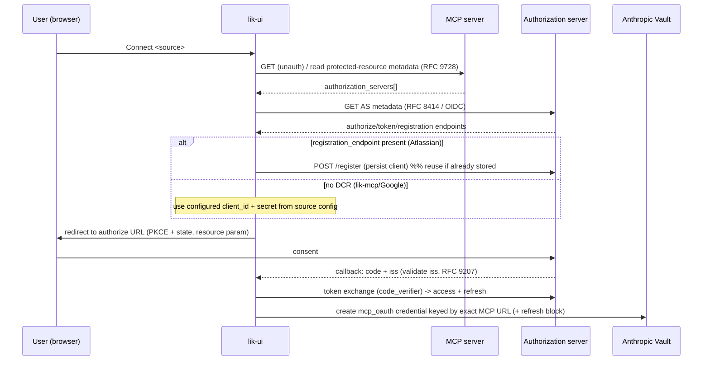
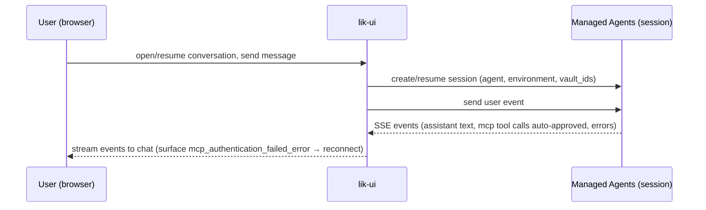

# feat: lik-ui — Managed Agent Companion App

## Summary

Build a new top-level `lik-ui/` Python web app: a FastAPI + server-rendered site where a Nava user
signs in (Google Workspace SSO), picks an agent, connects the data sources that agent declares
through a generic discovery-driven OAuth connector (self-registering via DCR where supported,
pre-configured client where not), and chats with a Claude Managed Agent whose session is
authenticated by the user's credential vault. The app's core work is the OAuth-and-vault plumbing
the Managed Agents platform does not do — obtaining each source's tokens and depositing them in the
user's vault — plus a streamed chat surface.

---

## Problem Frame

Claude Managed Agents supplies the agent loop, sandbox, and token refresh/injection, but runs
headless server-side sessions with no browser — so it cannot walk a user through OAuth consent, and
a session can only authenticate to an MCP server if a matching credential already sits in a vault.
Nothing in the repo obtains those credentials today; the only OAuth actor is lik-mcp, and it is a
*resource server*, not a client. Without a front door that handles login, per-source connection, and
chat, no real Nava user can reach the agent under their own identity. (See origin: `docs/brainstorms/2026-07-06-01-lik-ui-managed-agent-app-requirements.md`.)

---

## Requirements

- R1. App login is separate from data-source connections; app login assumed Google Workspace SSO (identity only).
- R2. Durable per-user record and persistent user→VAULT_ID mapping; returning users reuse their vault.
- R3. Selectable list of agents; each option pairs an agent with its environment; must accommodate multiple agents though only one exists today (`agent_01E7mqTKAdtosKpWDSLxALmq` / `env_016c6vWcCUvyVUaztWhvsAQt`).
- R4. Required connections are derived from the selected agent's declared MCP servers via the Claude SDK, not hardcoded.
- R5. A generic discovery-driven MCP-OAuth flow: discover the server's authorization server + endpoints (RFC 9728 → RFC 8414/OIDC), then run PKCE authorization-code with a registered callback; no hardcoded per-source endpoints.
- R6. Client acquisition by capability: DCR when the AS advertises `registration_endpoint` (persist the registration); a pre-configured client when not. DCR sources add with no per-source config; no-DCR sources add one config entry.
- R7. lik-mcp connection uses the pre-configured Google client `LIK_OAUTH_CLIENT_ID` (secret via env) with scopes `openid,email` + offline access, stored keyed by `LIK_RESOURCE_SERVER_URL`; Atlassian uses DCR.
- R8. Credentials key on the exact declared MCP server URL; store the OAuth `refresh` block (token endpoint + client id/secret) so the platform refreshes; surface a re-connect prompt on refresh failure.
- R9. Create a session referencing the selected agent, its environment, and the user's vault; stream responses into a web chat UI.
- R10. MCP tool calls are auto-approved — no per-call approval UI (realized via the agent's MCP permission policy; see Dependencies).
- R11. Conversations persist and are resumable: store session id(s) per user; re-open rather than always starting fresh.
- R12. Show per-source connection status for the selected agent; allow chatting before everything is connected (unconnected source → its tools unavailable; nudge, don't hard-block).

**Origin actors:** A1 (Nava user), A2 (lik-ui app), A3 (Managed Agents platform), A4 (data-source MCP servers), A5 (agent author, out of band).
**Origin flows:** F1 (log in and pick an agent), F2 (discover and connect required sources), F3 (chat with the agent).

---

## Scope Boundaries

- Building or managing agents/environments — lik-ui references them; it does not create or edit them (A5's job).
- lik-mcp server changes — the server's auth already works; lik-ui is a client of it.
- Per-call tool approval UI — auto-approve is the chosen behavior.
- Non-Google app login and any provider-selection UI beyond the agent list.
- A React/SPA frontend and JS build toolchain — server-rendered chosen.

### Deferred to Follow-Up Work

- Provisioning a stable, non-ngrok `LIK_RESOURCE_SERVER_URL` for lik-mcp: infra task, prerequisite for durable stored credentials (see Risks). Tracked outside this plan but blocks end-to-end lik-mcp use.
- Setting the auto-approve MCP permission policy on the agent definition (`agent_01E7mqTKAdtosKpWDSLxALmq`): agent-config task, external to lik-ui code.

---

## Context & Research

### Relevant Code and Patterns

- `lik-mcp/src/lik_mcp/settings.py` — pydantic `BaseSettings`, `env_prefix`, comma-string→list `@property`, `conninfo` builder. Mirror for `lik-ui`'s settings (prefix `LIK_UI_`).
- `lik-mcp/src/lik_mcp/__main__.py` — fail-closed startup (refuse to run when auth config missing outside local/test); `make_server(settings)` factory + DI. Mirror the fail-closed posture.
- `lik-mcp/src/lik_mcp/auth.py` — `httpx.AsyncClient` with explicit timeout, non-200 → deny, TTL cache capped at token expiry, and **never log the token, only the resolved email**. Reuse the async-httpx + expiry-capped-TTL shape; extend no-token-logging to authorization codes and refresh tokens.
- `lik-mcp/src/lik_mcp/db.py` — psycopg pool + `db/init.sql` bootstrap; `conftest.py` `_test`-suffix DB guard and TRUNCATE-between-tests. Mirror for lik-ui's store and test suite.
- `lik-mcp/docker-compose.yml` / `Dockerfile` — Postgres service + healthcheck, loopback-only host publish, `LIK_HTTP_ALLOWED_HOSTS` DNS-rebinding allowlist, env-driven config. Mirror shape for lik-ui.

### Institutional Learnings

- No `docs/solutions/` exists. lik-ui is the repo's first OAuth *client*; the DCR/PKCE/discovery/vault decisions are net-new with no repo precedent — capture them with `/ce-compound` after landing.
- Hard constraint from lik-mcp's verifier: deposited lik-mcp token must be a real Google token with `aud == LIK_OAUTH_CLIENT_ID`, `email_verified`, scopes `openid email`; a mismatch fails as a silent 401. (See origin R7.)

### External References

- Claude Managed Agents docs — agents, sessions, vaults, MCP connector, events/streaming, permission policies (beta header `managed-agents-2026-04-01`, set automatically by the SDK).
- MCP Authorization spec — OAuth 2.1 + PKCE, RFC 9728 protected-resource metadata, RFC 8414/OIDC AS metadata, RFC 7591 DCR, RFC 8707 resource indicators, RFC 9207 `iss` validation.
- Verified live: Atlassian remote MCP advertises `registration_endpoint` (`https://cf.mcp.atlassian.com/v1/register`) → DCR-capable; Google OIDC has no `registration_endpoint` → pre-configured client only.

---

## Key Technical Decisions

- **FastAPI + uvicorn + Jinja2, server-rendered, SSE for the chat stream.** No JS build toolchain; keeps everything Python and matches the repo's simplicity posture. `anthropic` SDK for platform calls; `httpx` for OAuth calls.
- **Python 3.14 + uv, `src/lik_ui/` package, `LIK_UI_` env prefix.** Resolves the repo's inconsistent Python signals by picking the `mise.toml`/CLAUDE.md version deliberately; separate prefix avoids collision with lik-mcp's `LIK_` while lik-ui carries its own copy of the lik-mcp client id/secret.
- **Own Postgres schema via psycopg** (not shared with lik-mcp): tables for users, user→vault, conversation→session, and app-level DCR registrations. Drop-and-recreate per CLAUDE.md; no migrations.
- **App login is an identity-only Google OIDC client, distinct from the lik-mcp data client.** Honors the brainstorm's decouple decision and keeps "more sources later" independent of login.
- **One generic OAuth connector, not per-source code.** A source-config registry supplies a client only for no-DCR authorization servers (lik-mcp/Google); DCR sources are discovered and self-registered at runtime, with the registration persisted and reused.
- **One managed session per conversation**, session ids stored per user; conversations are resumable.
- **Vault is created lazily on first login** and its id stored in the user→vault mapping; vault `metadata.external_user_id` also set to the app user id for cross-reference.

---

## Open Questions

### Resolved During Planning

- Per-source OAuth config discovered vs configured: endpoints always discoverable; only client-acquisition differs (DCR vs pre-configured). (Origin outstanding question — resolved.)
- Frontend shape: FastAPI server-rendered (user-selected).
- Conversation/session model: one session per conversation (user-selected).
- Google client secret: supplied via env var (user-confirmed).

### Deferred to Implementation

- Exact SSE event-to-DOM rendering for interleaved assistant text and MCP tool-call activity — depends on the concrete event shapes observed from the session stream.
- Whether DCR registration is stored per authorization-server issuer only, or also needs per-redirect-URI variants — settle when wiring the first real DCR round-trip against Atlassian.
- Precise token-expiry handling on the `mcp_oauth` credential `expires_at` field vs. relying on platform refresh — confirm against a live refresh cycle.
- Session resume semantics when a stored session id has been server-side expired/deleted — confirm the SDK's error and re-create path.

---

## Output Structure

    lik-ui/
      pyproject.toml
      uv.lock
      Dockerfile
      docker-compose.yml
      .env.example
      README.md
      db/
        init.sql
      src/lik_ui/
        __init__.py
        __main__.py            # uvicorn entrypoint / app factory
        settings.py            # pydantic BaseSettings, LIK_UI_ prefix
        db.py                  # psycopg pool + store access
        app.py                 # FastAPI app factory, routes wiring
        app_auth.py            # Google Workspace SSO (identity), session cookie, user guard
        vault.py               # Anthropic vault create/lookup + user→vault mapping
        oauth_connector.py     # discovery, client acquisition (DCR/configured), PKCE, callback, token exchange
        sources.py             # per-source config registry (no-DCR clients, e.g. lik-mcp/Google)
        agents.py              # agent registry + SDK query for declared MCP servers
        chat.py                # session create/resume + SSE streaming
        templates/             # Jinja2: login, agent picker, connections, chat
        static/                # minimal JS for SSE, CSS
      tests/
        conftest.py
        test_settings.py
        test_db.py
        test_app_auth.py
        test_vault.py
        test_oauth_connector.py
        test_sources.py
        test_agents.py
        test_chat.py

---

## High-Level Technical Design

> *This illustrates the intended approach and is directional guidance for review, not implementation specification. The implementing agent should treat it as context, not code to reproduce.*

Connect flow (F2) — generic per source:

Chat flow (F3):

---

## Implementation Units

- U1. **Project scaffold, settings, and container**

**Goal:** Stand up the `lik-ui/` Python project skeleton, config, and container so later units have a running app shell.

**Requirements:** R1 (config surface), enables all.

**Dependencies:** None.

**Files:**
- Create: `lik-ui/pyproject.toml`, `lik-ui/Dockerfile`, `lik-ui/docker-compose.yml`, `lik-ui/.env.example`, `lik-ui/README.md`
- Create: `lik-ui/src/lik_ui/__init__.py`, `lik-ui/src/lik_ui/__main__.py`, `lik-ui/src/lik_ui/settings.py`, `lik-ui/src/lik_ui/app.py`
- Test: `lik-ui/tests/test_settings.py`, `lik-ui/tests/conftest.py`

**Approach:**
- uv-managed, Python 3.14, `src/` layout, package `lik_ui`. Deps: `fastapi`, `uvicorn[standard]`, `jinja2`, `httpx`, `anthropic`, `psycopg[binary]`, `psycopg-pool`, `pydantic`, `pydantic-settings`; dev extra `pytest`, `pytest-asyncio`.
- `settings.py`: pydantic `BaseSettings`, `env_prefix="LIK_UI_"`. Fields include DB config, `env`, app-login client id/secret + redirect base URL, lik-mcp data client id (`= LIK_OAUTH_CLIENT_ID`) + secret + `LIK_RESOURCE_SERVER_URL`, Anthropic API key, agent registry source. Fail-closed: refuse to start outside local/test when required auth/vault config is missing (mirror `lik-mcp/__main__.py`).
- `app.py`: FastAPI app factory wiring routers; `__main__.py` runs uvicorn.

**Patterns to follow:** `lik-mcp/src/lik_mcp/settings.py`, `lik-mcp/src/lik_mcp/__main__.py`, `lik-mcp/Dockerfile`, `lik-mcp/docker-compose.yml`.

**Test scenarios:**
- Happy path: settings load from `LIK_UI_`-prefixed env; comma-string fields expose list `@property`.
- Edge case: missing required auth/vault config with `env` not local/test → startup raises (fail-closed); with `env=local` → starts with stubbed values.
- Happy path: app factory builds and mounts expected routers; health route returns ok.

**Verification:** `uv run pytest tests/test_settings.py` passes; `uvicorn` boots the app locally; container builds.

---

- U2. **Persistence layer and schema**

**Goal:** Postgres-backed store for users, user→vault mapping, conversation→session, and DCR registrations.

**Requirements:** R2, R6 (persist DCR), R11 (conversation→session).

**Dependencies:** U1.

**Files:**
- Create: `lik-ui/src/lik_ui/db.py`, `lik-ui/db/init.sql`
- Test: `lik-ui/tests/test_db.py`

**Approach:**
- psycopg connection pool + `conninfo` from settings, mirroring `lik-mcp/db.py`. Tables (names/columns are directional, settle at implementation): app users keyed by verified email; user→vault (one vault id per user); conversations (id, user, agent id, session id, created); dcr_registrations (keyed by authorization-server issuer → client id/secret + metadata).
- Store-access functions: upsert user, get/set user vault id, create/list/get conversation, get/put DCR registration.
- Drop-and-recreate philosophy; `init.sql` applied on first volume init (no migrations).

**Patterns to follow:** `lik-mcp/src/lik_mcp/db.py`, `lik-mcp/db/init.sql`, `lik-mcp/tests/conftest.py` (`_test`-suffix guard, TRUNCATE-between-tests).

**Test scenarios:**
- Happy path: upsert user is idempotent on email; second call returns same row.
- Happy path: set/get user→vault mapping round-trips; one vault per user enforced (unique).
- Happy path: create conversation then list returns it scoped to its user only.
- Edge case: get DCR registration for unknown issuer → none; put then get round-trips and reuse returns the stored client.
- Integration: `conftest` refuses to run against a non-`_test` DB (guard fires).

**Verification:** `uv run pytest tests/test_db.py` passes against a `_test` Postgres.

---

- U3. **App authentication (Google Workspace SSO) and vault provisioning**

**Goal:** Sign in with Google (identity only), establish a session, upsert the user, and lazily provision their credential vault.

**Requirements:** R1, R2.
**Origin flow:** F1.

**Files:**
- Create: `lik-ui/src/lik_ui/app_auth.py`, `lik-ui/src/lik_ui/vault.py`, `lik-ui/src/lik_ui/templates/login.html`
- Modify: `lik-ui/src/lik_ui/app.py`
- Test: `lik-ui/tests/test_app_auth.py`, `lik-ui/tests/test_vault.py`

**Approach:**
- `app_auth.py`: Google OIDC authorization-code login using the dedicated identity-only client (scopes `openid email` only — no data/offline scopes). On callback: verify, upsert user (U2), set a signed session cookie, guard dependency that redirects unauthenticated requests to login.
- `vault.py`: on first login (no mapping), create an Anthropic vault (`beta.vaults.create`, `metadata.external_user_id = app user id`), store the id in user→vault (U2); on subsequent logins reuse. Never log tokens/cookies.

**Patterns to follow:** `lik-mcp/src/lik_mcp/auth.py` (async httpx, non-200→deny, never-log-token); fail-closed posture from `__main__.py`.

**Test scenarios:**
- Happy path: successful OIDC callback sets session cookie and upserts user; authed request passes the guard.
- Error path: callback with invalid/missing code or unverified email → login rejected, no session, no user row.
- Edge case: unauthenticated request to a protected route → redirect to login.
- Happy path (vault): first login with no mapping creates a vault and stores its id with `external_user_id` metadata.
- Integration: second login for the same user reuses the existing vault id (no duplicate vault created).

**Verification:** login flow issues a session and a vault mapping exists for the user; protected routes reject anonymous access.

---

- U4. **OAuth connector: discovery and client acquisition**

**Goal:** From an MCP server URL, discover its authorization server and endpoints, and obtain a usable OAuth client (DCR or pre-configured).

**Requirements:** R5, R6, R7 (client side).

**Dependencies:** U1, U2 (persist DCR).

**Files:**
- Create: `lik-ui/src/lik_ui/oauth_connector.py` (discovery + client-acquisition portion), `lik-ui/src/lik_ui/sources.py`
- Test: `lik-ui/tests/test_oauth_connector.py` (discovery/client cases), `lik-ui/tests/test_sources.py`

**Approach:**
- Discovery: read protected-resource metadata (RFC 9728) for the MCP URL (via the `.well-known` path and/or the 401 `WWW-Authenticate` `resource_metadata` hint), extract `authorization_servers`, then fetch AS metadata (RFC 8414, falling back to OIDC discovery) to get authorize/token/registration endpoints and `scopes_supported`.
- Client acquisition: if `registration_endpoint` present and no stored registration for that issuer → POST a DCR request (RFC 7591) with lik-ui's redirect URI, persist the returned client id/secret (U2); reuse on subsequent connects. If no `registration_endpoint` → look up the source in `sources.py` config for a pre-configured client (lik-mcp → `LIK_OAUTH_CLIENT_ID` + env secret, scopes `openid,email`+offline).
- `sources.py`: registry keyed by MCP server URL (or issuer) → `{client acquisition mode, client id/secret env refs, extra scopes}`. Only no-DCR sources need an entry.

**Patterns to follow:** `lik-mcp/src/lik_mcp/auth.py` async-httpx shape, timeouts, non-200→deny, never-log-secrets.

**Test scenarios:**
- Happy path: PRM → AS metadata parsed; authorize/token endpoints extracted.
- Happy path (DCR): AS advertises `registration_endpoint` → registration POST issued, client persisted; second connect reuses stored client (no re-register).
- Happy path (configured): no `registration_endpoint` → source-config client returned (lik-mcp uses `LIK_OAUTH_CLIENT_ID`, scopes include `openid email` + offline).
- Error path: PRM/AS metadata unreachable or malformed → surfaced as a connect error, not a crash.
- Edge case: 401 without a `resource_metadata` hint → fall back to `.well-known` PRM path; if still absent, clear error.
- Error path: DCR returns non-2xx → connect fails with a diagnostic, nothing persisted.

**Verification:** given a stubbed AS/MCP, both acquisition modes yield an authorize URL + token endpoint + client; DCR persists and reuses.

---

- U5. **OAuth connector: authorize, callback, token exchange, vault deposit**

**Goal:** Run the PKCE authorization-code flow end to end and deposit the resulting credential in the user's vault keyed by the exact MCP URL.

**Requirements:** R5, R7, R8.
**Origin flow:** F2.

**Dependencies:** U3 (user/vault), U4 (client + endpoints).

**Files:**
- Modify: `lik-ui/src/lik_ui/oauth_connector.py` (authorize/callback/exchange/deposit)
- Modify: `lik-ui/src/lik_ui/vault.py` (credential create), `lik-ui/src/lik_ui/app.py` (connect + callback routes)
- Create: `lik-ui/src/lik_ui/templates/connections.html`
- Test: `lik-ui/tests/test_oauth_connector.py` (flow cases)

**Approach:**
- Build the authorize URL with PKCE (code_challenge), `state`, the RFC 8707 `resource` parameter (the MCP URL), and scopes per strategy; record code_verifier + expected issuer + state server-side (keyed to the user session).
- Callback: validate `state`; validate `iss` against the recorded issuer (RFC 9207); exchange code + code_verifier at the token endpoint → access + refresh tokens.
- Deposit: `beta.vaults.credentials.create` on the user's vault, `type=mcp_oauth`, `mcp_server_url` = the exact declared URL, `access_token`, `expires_at`, and a `refresh` block (token endpoint + client id/secret from U4, `token_endpoint_auth`). Re-connect updates/rotates the credential.
- Never log codes, tokens, or secrets.

**Patterns to follow:** origin R7/R8; `lik-mcp/src/lik_mcp/auth.py` (no-token-logging, deny-on-error).

**Test scenarios:**
- Happy path: authorize URL contains PKCE challenge, state, and resource param; callback with matching state + valid iss exchanges code → tokens → vault credential created keyed by the exact MCP URL with a refresh block.
- Error path: callback state mismatch → rejected, no token exchange.
- Error path: `iss` mismatch (RFC 9207) → rejected before token exchange; error not displayed.
- Error path: token endpoint returns error → connect fails, no credential written.
- Edge case: re-connecting an already-connected source rotates the credential rather than creating a duplicate (unique `mcp_server_url` per vault).
- Covers AE-equivalent: deposited lik-mcp credential is a Google token request for `LIK_OAUTH_CLIENT_ID` with `openid email` (+offline) keyed by `LIK_RESOURCE_SERVER_URL`.

**Verification:** against a stubbed AS, a full connect writes a correctly-keyed `mcp_oauth` credential to the user's vault; adversarial state/iss cases are rejected.

---

- U6. **Agent selection and required-connection resolution**

**Goal:** Let the user pick an agent, query its declared MCP servers via the SDK, and show which are connected vs missing.

**Requirements:** R3, R4, R12.
**Origin flows:** F1, F2.

**Dependencies:** U3, U5.

**Files:**
- Create: `lik-ui/src/lik_ui/agents.py`, `lik-ui/src/lik_ui/templates/agents.html`
- Modify: `lik-ui/src/lik_ui/app.py`, `lik-ui/src/lik_ui/templates/connections.html`
- Test: `lik-ui/tests/test_agents.py`

**Approach:**
- Agent registry (config): list of `{label, agent_id, environment_id}`; one today (`agent_01E7mqTKAdtosKpWDSLxALmq` / `env_016c6vWcCUvyVUaztWhvsAQt`).
- On select: `beta.agents.retrieve(agent_id)` → declared `mcp_servers` (name + url). Compare each declared URL against the user's vault credentials (U5) to compute connected/missing. Render status with a connect action per missing source (drives U5). Store the current agent selection in the session.
- Chatting is allowed with missing sources; missing ones are shown as unavailable (R12).

**Patterns to follow:** anthropic SDK beta agents; connection-status rendering in `connections.html`.

**Test scenarios:**
- Happy path: selecting the sole agent retrieves its declared servers and renders each with connected/missing status derived from vault contents.
- Edge case: agent declares a server the user hasn't connected → shown missing with a connect action; a connected one → shown connected.
- Edge case: agent with zero declared servers → chat available immediately, no connect prompts.
- Error path: SDK agent retrieval fails → user sees an error state, not a crash.
- Integration: after completing a connect (U5) for a missing source, re-resolving flips it to connected.

**Verification:** the connections page reflects true vault state for the selected agent; connecting a missing source updates the status.

---

- U7. **Chat: session create/resume and SSE streaming**

**Goal:** Create or resume a managed session for the selected agent + environment + vault and stream the conversation into the browser.

**Requirements:** R9, R10, R11, R12.
**Origin flow:** F3.

**Dependencies:** U3, U6.

**Files:**
- Create: `lik-ui/src/lik_ui/chat.py`, `lik-ui/src/lik_ui/templates/chat.html`, `lik-ui/src/lik_ui/static/chat.js`
- Modify: `lik-ui/src/lik_ui/app.py`, `lik-ui/src/lik_ui/db.py` (conversation↔session)
- Test: `lik-ui/tests/test_chat.py`

**Approach:**
- New conversation → `beta.sessions.create(agent, environment_id, vault_ids=[user vault])`; persist conversation→session (U2). Resume → reuse stored session id.
- Send the user message as an event; stream session SSE events to the browser over a lik-ui SSE endpoint; `chat.js` renders assistant text and MCP tool-call activity incrementally.
- MCP tool calls are auto-approved (agent-side policy; see Dependencies) — lik-ui renders no approval prompts. Surface `session.error` events (`mcp_connection_failed_error` / `mcp_authentication_failed_error`) as a per-source reconnect nudge (links back to U5) without killing the chat.

**Patterns to follow:** anthropic SDK beta sessions + event stream; FastAPI `StreamingResponse`/SSE.

**Test scenarios:**
- Happy path: new conversation creates a session with the user's `vault_ids`; user message produces streamed assistant events rendered in order.
- Happy path (resume): reopening a stored conversation reuses its session id rather than creating a new session.
- Integration: an assistant turn that invokes an MCP tool streams tool-call activity with no approval prompt (auto-approve).
- Error path: `mcp_authentication_failed_error` event → reconnect nudge for the named source; chat remains usable.
- Edge case (deferred-confirm): stored session id no longer valid server-side → create a fresh session and continue (behavior confirmed at implementation).
- Edge case: sending before any source is connected → chat works; tools for unconnected sources are simply unavailable.

**Verification:** a user can hold a streamed conversation that uses connected sources, resume it later, and see a reconnect nudge when a credential is rejected.

---

## System-Wide Impact

- **Interaction graph:** lik-ui is a new service; it calls the Anthropic platform (agents/sessions/vaults) and each source's authorization server + MCP endpoint. It depends on the external agent definition (`agent_01E7mqTKAdtosKpWDSLxALmq`) for declared servers and permission policy.
- **Error propagation:** OAuth/discovery failures surface as connect errors (fail the connect, write nothing); session MCP errors surface as non-fatal reconnect nudges; app-auth failures fail closed to login.
- **State lifecycle risks:** partial connect (token obtained but vault write fails) must not leave a half-registered source; DCR registration must be written once and reused; credential rotation on re-connect must not duplicate (unique `mcp_server_url`).
- **API surface parity:** the generic connector must work for any future declared source without new per-source code except a config entry for no-DCR providers.
- **Integration coverage:** discovery→DCR→PKCE→vault-deposit and session-stream event handling are the cross-layer paths unit mocks alone won't fully prove — cover with stubbed AS/session in U4/U5/U7.
- **Unchanged invariants:** lik-mcp server code and its Google-token verification are unchanged; lik-ui must satisfy that contract exactly (`aud == LIK_OAUTH_CLIENT_ID`, `openid email`).

---

## Risks & Dependencies

| Risk | Mitigation |
|------|------------|
| `LIK_RESOURCE_SERVER_URL` is an ephemeral ngrok URL; credentials keyed to it silently stop matching after a restart (R8). | Treat a stable lik-mcp resource-server URL as a blocking prerequisite (Deferred to Follow-Up). Until then, expect lik-mcp reconnects after URL rotation. |
| lik-mcp token minted for the wrong client fails as a silent 401. | Reuse `LIK_OAUTH_CLIENT_ID` verbatim + scopes `openid email`; assert in U5 tests. |
| Auto-approve depends on the external agent's MCP permission policy; if unset, tool calls block. | Prerequisite: set auto-approve policy on the agent definition (Deferred to Follow-Up); U7 assumes it. |
| Handling raw authorization codes, access + refresh tokens across providers widens the secret-exposure surface. | Never-log-secrets rule from day one (extend lik-mcp's pattern); store secrets only in the vault / DB; PKCE + state + iss validation. |
| DCR against Atlassian may need redirect-URI/registration details that differ from assumptions. | Validate against live Atlassian metadata during U4; persist and reuse the registration; keep source-config seam for overrides. |
| Client-side OAuth is net-new in the repo (no precedent). | Grounded in the MCP spec + verified live metadata; capture learnings with `/ce-compound` after landing. |

---

## Documentation / Operational Notes

- `lik-ui/README.md` and `.env.example` document required env (`LIK_UI_`-prefixed): app-login client id/secret + redirect base, lik-mcp data client id/secret, `LIK_RESOURCE_SERVER_URL`, Anthropic API key, DB config, agent registry.
- Register redirect/callback URIs per provider: app-login and lik-mcp/Google in the Google console; Atlassian via the DCR registration request.
- Compose brings up Postgres + lik-ui (loopback publish + allowed-hosts guard, mirroring lik-mcp). Drop-and-recreate DB for schema changes.

---

## Sources & References

- **Origin document:** [docs/brainstorms/2026-07-06-01-lik-ui-managed-agent-app-requirements.md](docs/brainstorms/2026-07-06-01-lik-ui-managed-agent-app-requirements.md)
- Related code: `lik-mcp/src/lik_mcp/auth.py`, `lik-mcp/src/lik_mcp/settings.py`, `lik-mcp/src/lik_mcp/db.py`, `lik-mcp/docker-compose.yml`
- External docs: Claude Managed Agents (agents/sessions/vaults/mcp-connector/events/permission-policies); MCP Authorization spec (RFC 9728/8414/7591/8707/9207).
