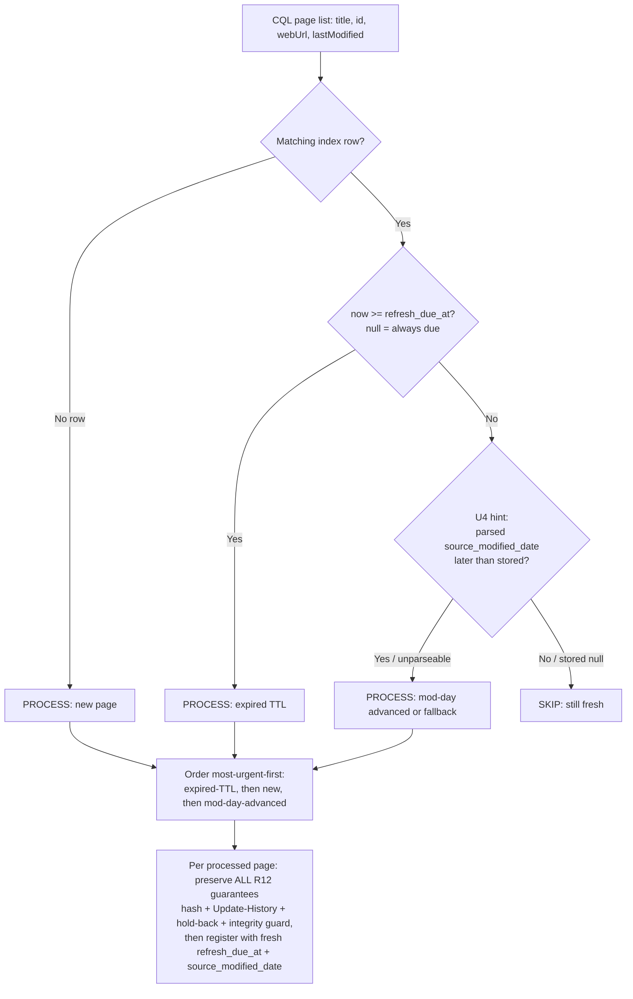

# feat: Catalog `refresh_due_at` — TTL-driven, trust-tiered incremental sync

## Summary

Add two nullable Catalog columns — `refresh_due_at` (when a row is next due for re-derivation) and
`source_modified_date` (a day-granular hint parsed from Confluence's `lastModified`) — and split
`sync-catalog-from-project-indexes` into a fast **routine** mode that does the expensive per-page work only
for rows that are past-due, not-yet-catalogued, or whose modification day advanced, and an explicit **full
sweep** that re-checks every page as today. The data layer stays generic and dumb (it just persists whatever
`refresh_due_at` timestamp it is handed); the trust-tiered TTL interval policy and all Confluence-specific
`lastModified` parsing live in the skill. The R11 pre-implementation spike is **done and green** (see origin +
[spike results](../brainstorms/2026-07-27-02-catalog-refresh-due-ttl-spike-results.md)); its one hard
constraint — the hint is sourced only from the CQL result, never `getConfluencePage` — is carried into U4.

---

## Problem Frame

`sync-catalog-from-project-indexes` re-fetches and re-hashes **every** project-index page on every run
(body hash + Update-History child per page). Cost scales linearly with page count — the skill is documented
as "an expensive crawl — run on demand only." It catches every edit every run but has no way to spend less
effort on pages that almost certainly haven't changed. This addresses the "prioritize which rows to
re-derive first and how often" half of the Catalog-maintenance TODO in `lik-mcp/README.md` (the *aging-out*
half is explicitly deferred — see origin).

---

## Requirements

Carried from origin ([requirements doc](../brainstorms/2026-07-27-02-catalog-refresh-due-ttl-requirements.md)),
R-IDs preserved:

- R1. Add nullable `refresh_due_at` — a *future* target set at registration; distinct from `last_computed_at`
  (past) and `freshness`.
- R2. Add nullable **date** `source_modified_date` from Confluence `lastModified`; day granularity deliberate.
  camelCase `lastModified` → snake_case column.
- R3. Both columns generic to any Catalog row/registrar — nothing Confluence- or index-specific. Only the
  skill's *use* of them is scoped to project-index rows.
- R4. Schema change is non-destructive (`ALTER TABLE ... ADD COLUMN`, nullable). No `refresh_due_at` = always
  due; no `source_modified_date` = "day unknown → do not skip on the hint." Prod migration is a separate step.
- R5. `register_catalog_entry` accepts and persists both; `list_catalog_entries` returns them.
- R6. On register/update, set `refresh_due_at = <run time> + interval`, interval by trust tier.
- R7. Ordering fixed (verified-current ≥ unverified ≥ stale/drifted); the numbers are the planner's.
- R8. Routine run: read index rows, fetch the cheap CQL page list, do per-page work **only** for pages that
  are (a) past-due, (b) not catalogued, or (c) whose parsed `source_modified_date` is later than stored; skip
  the rest; stamp fresh `refresh_due_at` + parsed `source_modified_date` on processed rows.
- R9. Routine processing order most-urgent-first: expired-TTL, then new, then modification-day-advanced.
- R10. Full sweep: re-check every page, ignoring `refresh_due_at` and the hint; re-stamp both columns.
- R11. The hint is derived only from the `lastModified` in the cheap CQL result — never a per-page fetch.
  Day-granular, fixed-tz, over the known format set, with always-process fallback on unparseable strings.
- R12. All existing skill guarantees preserved for every page processed: Response integrity guard,
  `source_state` hashing recipe (shared with `query-project-index`), "DO NOT USE" hold-back, Update-History
  verification.

**Origin actors:** the operator who runs the sync skill; the `query-project-index` skill (shares the hashing
recipe — must stay compatible).
**Origin flows:** routine run (F: R8/R9), full sweep (F: R10).
**Origin acceptance examples:** AE1 fast routine run, AE2 new page, AE3 mod-day advances → re-checked, AE4
same-day edit under-flagged but bounded, AE5 unparseable → processed, AE6 trust tiering bites, AE7 full sweep
ignores hints, AE8 migration safety.

---

## Scope Boundaries

- **Not** aging out / deleting obsolete rows — the other half of the README TODO (deferred).
- **Not** touching the confirmation-table maintenance TODOs.
- **Not** rolling the two-mode pattern into other sync-catalog skills — the columns are generic and reusable,
  but only `sync-catalog-from-project-indexes` adopts two-mode behavior in this pass.
- **Not** changing how `query-project-index` consumes rows (ranking, freshness display, confirmation weight).
- **Not** the pre-existing `sensitivity=cleared` vs. schema-default `restricted` inconsistency the sync skill
  carries (noted in System-Wide Impact; left as-is to keep this change focused).
- **Not** scheduling/automation of the full sweep — that is the separate
  [scheduled-unattended-runs](../brainstorms/2026-07-27-03-scheduled-unattended-agent-runs-requirements.md)
  brainstorm; here the full sweep is operator-triggered only.

### Deferred to Follow-Up Work

- **Applying the `ALTER TABLE` to production `lik-prod-db`** is a required, separate post-merge step (not a
  code commit). See Operational Notes.

---

## Context & Research

### Relevant Code and Patterns

- `lik-mcp/db/init.sql` (lines 16-39) — `catalog` table; enum-ish fields are plain `text` + `DEFAULT`, no
  `CHECK`. Trust-tier inputs already present: `verification` (`human-verified`/`unverified`), `freshness`
  (`current`/`stale`/`obsolete`). Idempotent `CREATE TABLE IF NOT EXISTS` — will **not** add columns to an
  existing (prod) table. Migration convention: append idempotent `ALTER TABLE ... ADD COLUMN IF NOT EXISTS`
  after the CREATE block (precedent: `docs/plans/2026-07-23-006-feat-shared-sessions-plan.md:184`).
- `lik-mcp/src/lik_mcp/catalog.py` — `CatalogEntry` Pydantic model (lines 24-49); `_UPSERT` (85-107) lists
  all writable columns **explicitly** in INSERT / VALUES / `DO UPDATE SET`; `register_catalog_entry`
  (127-143) builds params via `entry.model_dump()`; `list_catalog_entries` (155-164) is `SELECT *` (new
  columns auto-returned); `_serialize` (123-124) ISO-formats only `datetime`.
- `lik-mcp/src/lik_mcp/server.py` — the `register_catalog_entry` MCP tool takes the whole `entry:
  CatalogEntry` (FastMCP derives the schema from the model), so new model fields auto-expose; `updated_by`
  comes from the verified token, not a param.
- `lik-mcp/tests/test_catalog.py` + `conftest.py` — tests call the plain `catalog.py` functions directly;
  DB on port **5432**, `LIK_DB_NAME` must end `_test` (hard gate), `TRUNCATE ... RESTART IDENTITY` per test.
  `test_source_refs_source_state_round_trips` is the round-trip template for a new persisted field.
- `claude_platform/skills/sync-catalog-from-project-indexes/SKILL.md` — current 4-step algorithm and the four
  guarantees R12 preserves. `claude_platform/skills/query-project-index/SKILL.md` (lines 144-149) holds the
  mirror copy of the `source_state` hashing recipe.

### Institutional Learnings

- `docs/solutions/` has no directly relevant entry (only an unrelated SSE doc). The load-bearing knowledge is
  in `limitations.md` (now updated with the spike) and the origin/spike brainstorm docs.
- **After this lands**, the CQL-vs-`getConfluencePage` `lastModified` divergence is a strong `docs/solutions/`
  candidate — a reusable connector gotcha.

### External References

- `limitations.md` — Confluence connector: no version number, no native timestamp; `lastModified` jitters
  raw, usable only at day granularity; wrong-page-under-concurrency → Response integrity guard. Updated
  2026-07-27 with the spike's endpoint-divergence finding.

---

## Key Technical Decisions

- **Column names:** `refresh_due_at` (`timestamptz`, nullable) and `source_modified_date` (`date`, nullable).
  Rationale: `refresh_due_at` reads unambiguously as "next re-derivation due"; `source_modified_date` names
  the day granularity; both avoid `ttl_date` (reads as "delete after"). *(user-confirmed)*
- **TTL interval policy lives in the skill, not the Python layer.** The data layer persists whatever
  `refresh_due_at` timestamp it is handed and computes no intervals. Each sync-catalog skill owns its own
  interval numbers. Rationale: R3 (columns generic) + store-agnostic principle; keeps Python dumb and lets
  different skills tune independently. *(user-confirmed)*
- **Interval defaults for this skill:** verified-current **30d**, unverified **14d**, stale/drifted **3d** —
  the skill's initial, tunable policy. Ordering fixed per R7; the numbers are documented in the SKILL.md as
  that skill's to change.
- **The `source_modified_date` hint is sourced ONLY from the CQL search result's `lastModified`** — never
  from `getConfluencePage` (spike hard constraint: the per-page field is cached/stale and returned a 21-day
  stale value after a real body edit while the CQL field advanced correctly). This also satisfies R11's
  "never from a new per-page fetch."
- **Day normalization pins a single fixed timezone: UTC.** The connector exposes no tz; UTC at worst
  over-flags near midnight (an extra fetch — safe), never under-flags in a harmful way.
- **Parser format set** (from the spike census): `less than a minute ago`, `about N hours ago`, `Mon DD,
  YYYY` (date-only) → parse to a calendar date; **any unrecognized shape** (`yesterday`, `last week`,
  localized/abbreviated) → **always-process fallback** (never skip on a guess).
- **No hard per-run count cap** by default — the TTL-driven due-set is the only bound. R9's most-urgent-first
  ordering already makes an interrupted/capped run do the highest-value work first, so a cap can be added
  later without redesign.
- **Full sweep is operator-triggered by an explicit invocation phrase** (e.g. "full sweep" / "full resync"),
  with routine as the default when the skill is invoked normally. No automatic schedule in this pass.
- **`_serialize` extended to handle `date`** so `source_modified_date` returns as an ISO `YYYY-MM-DD` string
  (a `DATE` column yields `datetime.date`, which is not a `datetime`).

---

## Open Questions

### Resolved During Planning

- Column names → `refresh_due_at`, `source_modified_date` (user-confirmed).
- Where interval values live → in the skill (user-confirmed); this skill's defaults 30d/14d/3d.
- Hard count cap → none by default (due-set is the bound).
- Full-sweep trigger → explicit invocation phrase; no auto-schedule this pass.
- Fixed tz → UTC.

### Deferred to Implementation

- Exact wording of the skill's format-parser rules (the format set is pinned by the spike; the precise
  phrasing of the day-parse instructions is finalized while editing the SKILL.md).
- The precise "modification day advanced" comparison prose when the stored `source_modified_date` is null —
  per R4 this is treated as always-process; the exact instruction wording is settled in U4.
- Whether Step 3b (child-only-edit over-flag behavior) is worth characterizing later — optional per the
  spike; not required to ship.

---

## High-Level Technical Design

> *This illustrates the intended approach and is directional guidance for review, not implementation
> specification. The implementing agent should treat it as context, not code to reproduce.*

**Trust tier → interval (skill policy, U3):**

| Row state on this run | Interval added to run-time | `refresh_due_at` set to |
|---|---|---|
| `human-verified` AND `freshness = current` | 30 days | run-time + 30d |
| `unverified` (any freshness not stale/drifted) | 14 days | run-time + 14d |
| `stale` / drifted on the run that produced it | 3 days | run-time + 3d |

**Routine-run per-page decision (U3 core + U4 hint) — does this page get the expensive per-page work?**

Full sweep (U3): skip the decision entirely — process every page as today, ignoring `refresh_due_at` and the
hint, re-stamping both columns.

---

## Implementation Units

- U1. **Add the two Catalog columns (schema + prod-safe migration)**

**Goal:** `catalog` gains `refresh_due_at timestamptz` and `source_modified_date date`, both nullable, on
fresh DBs and (idempotently) on existing ones.

**Requirements:** R1, R2, R3, R4

**Dependencies:** None

**Files:**
- Modify: `lik-mcp/db/init.sql`

**Approach:**
- Add both columns to the `CREATE TABLE catalog (...)` block (for fresh/local DBs).
- Append, after the CREATE block, idempotent non-destructive migration statements:
  `ALTER TABLE catalog ADD COLUMN IF NOT EXISTS refresh_due_at timestamptz;` and
  `ALTER TABLE catalog ADD COLUMN IF NOT EXISTS source_modified_date date;` (both nullable, no default — a
  null carries the R4 semantics: always-due / never-skip-on-hint).
- Mirror the file's existing comment style documenting each column's meaning.

**Patterns to follow:**
- The idempotent-`ALTER`-after-`CREATE` migration pattern (`docs/plans/2026-07-23-006-...:184`).

**Test scenarios:**
- Test expectation: none -- pure DDL; the column existence and semantics are exercised by U2's round-trip
  tests (which run `init.sql` in the `db` fixture) and confirmed manually via `\d catalog`.

**Verification:**
- Running `init.sql` against a fresh DB and against a populated one both yield a `catalog` with the two new
  nullable columns and no row loss.

---

- U2. **Persist and return the two columns in the data layer**

**Goal:** `register_catalog_entry` accepts and writes both values; `list_catalog_entries` (and the other
`SELECT *` readers) return them correctly serialized.

**Requirements:** R5, R1, R2, R4

**Dependencies:** U1

**Files:**
- Modify: `lik-mcp/src/lik_mcp/catalog.py`
- Test: `lik-mcp/tests/test_catalog.py`

**Approach:**
- Add to `CatalogEntry`: `refresh_due_at: Optional[datetime] = None` and `source_modified_date:
  Optional[date] = None` (import `date` from `datetime`). Both default `None` so producers supply only what
  they know (R4).
- Thread both columns through `_UPSERT`: the INSERT column list, the `VALUES` placeholders, and the
  `ON CONFLICT ... DO UPDATE SET` list (each `= EXCLUDED.col`).
- Extend `_serialize` to ISO-format `date` as well as `datetime` (e.g. `isinstance(v, (datetime, date))`),
  so `source_modified_date` round-trips as `YYYY-MM-DD`.
- The MCP tool surface needs no change — the tool takes `entry: CatalogEntry`, so the schema regenerates.

**Patterns to follow:**
- `test_source_refs_source_state_round_trips` / `_no_source_state` (register with the field set/unset →
  `list_catalog_entries` → assert the round-tripped value on `entries[0][...]`).

**Test scenarios:**
- Happy path: register an `index` row with both `refresh_due_at` (a `datetime`) and `source_modified_date`
  (a `date`) set → `list_catalog_entries("index")` returns them; `refresh_due_at` is an ISO datetime string
  and `source_modified_date` is a `YYYY-MM-DD` string. *(Covers R5.)*
- Edge case: register a row with both fields omitted → both come back `null` (R4 defaults; AE8 pre-existing
  rows). *(Covers AE8.)*
- Happy path (upsert): re-register the same `(entry_type, subject, computed_by)` with a **new**
  `refresh_due_at` and `source_modified_date` → the row updates in place (same `id`, `status == "updated"`)
  and the new values are stored (the `DO UPDATE SET` path). *(Covers R6 persistence, AE6/AE7 re-stamping.)*
- Edge case: `source_modified_date` set but `refresh_due_at` null (and vice-versa) → each persists/serializes
  independently.

**Verification:**
- `uv run pytest lik-mcp/tests/test_catalog.py` passes against the local `_test` DB (port 5432); both values
  round-trip in the expected serialized forms.

---

- U3. **Split the sync skill into routine + full-sweep modes (core, no hint bucket)**

**Goal:** `sync-catalog-from-project-indexes` gains a default **routine** mode (process only past-due + not-
yet-catalogued pages, most-urgent-first, stamping trust-tiered `refresh_due_at`) and an explicit **full
sweep** (today's every-page behavior), with all R12 guarantees preserved on every processed page.

**Requirements:** R6, R7, R8 (a & b), R9, R10, R12

**Dependencies:** U2 (the skill can only stamp/read the columns once the data layer persists them)

**Files:**
- Modify: `claude_platform/skills/sync-catalog-from-project-indexes/SKILL.md`

**Approach:**
- Add a mode preamble: **routine** is the default; **full sweep** triggers on an explicit phrase ("full
  sweep" / "full resync"). Full sweep = the current algorithm unchanged, additionally re-stamping both new
  columns (ignoring `refresh_due_at` and the hint).
- Routine algorithm: (1) `list_catalog_entries("index")` to read each page's `refresh_due_at`; (2) the
  existing cheap CQL page-list step; (3) select pages to process = **past-due** (`now >= refresh_due_at`;
  null = always due) OR **not-yet-catalogued** (no matching row by `subject`=title / `locator`=page id);
  (4) skip the rest; (5) for each processed page run the *unchanged* per-page work (Step 1 hash + Step 2
  Update-History + hold-back + Response integrity guard) and register with a fresh trust-tiered
  `refresh_due_at`.
- Trust-tier interval policy (this skill's, tunable): document the 30d/14d/3d table; interval chosen from the
  row's `verification` + `freshness` on this run (R6/R7). Compute `refresh_due_at = run-time + interval`.
- Ordering: process most-urgent-first — expired-TTL, then new pages (R9). (The mod-day-advanced bucket is
  added in U4 and slots last in this order.)
- Update the skill's opening description and Step 4 summary to reflect two modes and report
  skipped/processed counts.

**Execution note:** SKILL.md is agent-instruction prose; validate by dry-running each acceptance example
against the connector rather than by automated tests.

**Patterns to follow:**
- The existing Step 1–4 structure and the four guarantee sections — extend, don't rewrite; keep the shared
  hashing recipe and integrity-guard text intact (R12).

**Test scenarios:**
- Test expectation: none -- SKILL.md is agent-instruction prose, not executable code. Validated by dry-run
  against the acceptance examples (below) in a connector-enabled session.

**Verification:**
- AE1 (200 pages, 190 fresh / 10 past-due → ~10 processed, markedly faster) holds on a dry run.
- AE2 (new page always processed regardless of TTL, gets a fresh `refresh_due_at`).
- AE6 (two pages one `human-verified/current`, one `stale` → the stale one comes due sooner).
- AE7 (full sweep re-hashes all pages ignoring both columns, re-stamps both).
- Every processed page still runs the integrity guard, hash recipe, hold-back, and Update-History logic (R12
  unchanged).

---

- U4. **Add the `source_modified_date` pre-filter hint bucket (R11) — isolated / droppable**

**Goal:** routine mode also re-checks in-TTL pages whose modification day advanced, using a day-granular
hint parsed **only** from the CQL result's `lastModified`, with an always-process fallback — kept isolated so
the documented fallback (drop this bucket) is a localized removal.

**Requirements:** R8 (c), R11, R2

**Dependencies:** U3

**Files:**
- Modify: `claude_platform/skills/sync-catalog-from-project-indexes/SKILL.md`

**Approach:**
- In the routine page-selection step, add a third process-trigger: a page whose freshly-parsed
  `source_modified_date` is **later than** the stored one. Add it **last** in the most-urgent-first order
  (after expired-TTL and new).
- Parsing rules (document explicitly, citing the spike): derive the hint **only** from the `lastModified`
  already on the CQL result — never `getConfluencePage` (stale). Parse the known format set (`less than a
  minute ago`, `about N hours ago`, `Mon DD, YYYY`) to a calendar date normalized to **UTC**; any
  unrecognized shape → **always-process fallback** (never skip on a bad hint). A stored `source_modified_date`
  of null → never skip on the hint (R4).
- On every processed page, stamp the parsed `source_modified_date` alongside `refresh_due_at` (R8 step 5).
- Add a clearly-marked note that this whole bucket is optional: if the connector's format set drifts and the
  parser becomes unreliable, drop this trigger and routine mode still covers expired-TTL + not-yet-catalogued
  (the documented fallback).

**Execution note:** dry-run the R11-specific acceptance examples against the live connector; the hint's
CQL-only sourcing is the load-bearing detail to verify.

**Patterns to follow:**
- The spike results doc's format set + endpoint constraint; `limitations.md` Option B discussion.

**Test scenarios:**
- Test expectation: none -- SKILL.md prose. Validated by dry-run against the acceptance examples below.

**Verification:**
- AE3 (page edited yesterday, `source_modified_date` parses later than stored → re-hashed even though TTL not
  lapsed).
- AE4 (same-day edit: TTL not expired and mod-day unchanged → skipped; drift surfaced at next TTL lapse or
  full sweep — never silently permanent).
- AE5 (unparseable `lastModified` → processed via fallback, not skipped).
- Manual check: the hint is read from the CQL result only; no code path reads `lastModified` from a
  `getConfluencePage` response for the hint.

---

## System-Wide Impact

- **Interaction graph:** `register_catalog_entry` MCP tool input schema gains two optional fields
  (auto-derived from `CatalogEntry`). Backward compatible — existing callers that omit them get nulls.
  `query-project-index` shares the `source_state` hashing recipe; it is **not** changed and stays compatible
  (R12).
- **Error propagation:** unparseable `lastModified` degrades to always-process (never a hard error); a null
  stored `refresh_due_at`/`source_modified_date` is treated as due / never-skip, so pre-migration rows behave
  safely until first re-derivation (AE8).
- **State lifecycle risks:** routine mode *skips* still-fresh pages by design — a same-day edit to a skipped
  page is not noticed until its TTL lapses or a full sweep runs. Accepted and bounded per origin (not a
  defect). The body hash remains drift source-of-truth for every processed page.
- **API surface parity:** the columns are generic (R3); other sync-catalog skills may adopt them later
  without change. Only this skill's `lastModified` parser is Confluence-facing and stays isolated in the
  SKILL.md.
- **Unchanged invariants:** the `source_state` body-hash recipe, the Response integrity guard, the "DO NOT
  USE" hold-back flow, and Update-History verification are preserved verbatim for every processed page (R12).
  The pre-existing `sensitivity=cleared` (vs. schema default `restricted`) quirk in the sync skill is left
  untouched.

---

## Risks & Dependencies

| Risk | Mitigation |
|------|------------|
| Prod `lik-prod-db` not migrated after merge → routine mode reads/writes missing columns | Explicit post-merge `ALTER` step in Operational Notes; offer to help apply it. `init.sql`'s `CREATE IF NOT EXISTS` will not add columns to prod — the appended idempotent `ALTER` reached via `scripts/init_db.py` is the mechanism. |
| Atlassian changes the `lastModified` format → parser misses | Always-process fallback (R11); U4 bucket is isolated and droppable without touching U3. |
| Skipping hides same-day edits | Bounded by trust-tiered TTL (R6) + full sweep (R10); accepted trade per origin. |
| Concurrency returns the wrong page's body | Response integrity guard preserved unchanged (R12) — serialize `getConfluencePage`, assert `id == pageId`. |
| Hint accidentally sourced from `getConfluencePage` (stale) | Decision + U4 verification explicitly forbid it; spike proved the per-page field is stale. |

---

## Documentation / Operational Notes

- **Required separate prod step (post-merge):** apply the two `ALTER TABLE catalog ADD COLUMN IF NOT EXISTS`
  statements to `lik-prod-db` (via `scripts/init_db.py` against the prod-resolved settings, or an equivalent
  `psql` run). This is non-destructive and idempotent. Offer to help the user run it after the PR merges.
- **Candidate `docs/solutions/` entry after landing:** the CQL-vs-`getConfluencePage` `lastModified`
  divergence — a reusable Confluence-connector gotcha.

---

## Sources & References

- **Origin document:** [catalog-refresh-due-ttl requirements](../brainstorms/2026-07-27-02-catalog-refresh-due-ttl-requirements.md)
- **Spike results (R11 gate, green):** [spike results](../brainstorms/2026-07-27-02-catalog-refresh-due-ttl-spike-results.md)
- Connector limitations: `limitations.md`
- Data layer: `lik-mcp/src/lik_mcp/catalog.py`, `lik-mcp/db/init.sql`, `lik-mcp/tests/test_catalog.py`
- Skill: `claude_platform/skills/sync-catalog-from-project-indexes/SKILL.md`
