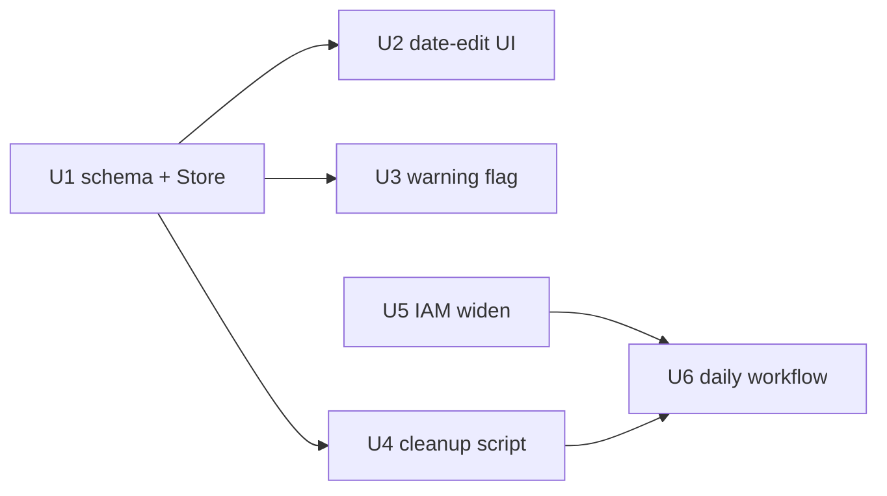

# feat: Chat session auto-delete

## Summary

Add an `auto_delete_at` timestamp to each chat session (default 7 days after creation, user-editable
but not disableable), surface it in the UI with a warning as deletion nears, and add a daily scheduled
GitHub Action that deletes expired sessions — platform transcript first, then the database row — with no
internet-facing endpoint and no long-lived shared secret.

---

## Problem Frame

Chat sessions accumulate forever. Each Postgres `sessions` row is only a pointer; the real transcript and
any stored credentials live on the Anthropic Managed Agents platform. Nothing ages out on its own — a
session leaves only when a user manually deletes it. That is a storage/cost and data-minimization liability.
Because deletion is irreversible and destroys real platform data, the timer must be predictable to users
(visible date they can push out) and must actually remove platform-side data, not just the local pointer.
See origin for full framing.

---

## Requirements

- R1. Each session has an `auto_delete_at`; new sessions default to 7 days after creation.
- R2. The owner can change a session's `auto_delete_at` to a later or earlier date.
- R3. A session always has a date — no permanent opt-out.
- R4. Existing sessions receive `auto_delete_at = created_at + 7 days` (no session left without a date).
- R5. The date is visible and editable on the per-session settings surface (owner-scoped), mirroring the
  existing share toggle.
- R6. Sessions nearing their date are visually flagged in the sessions list; no email/push.
- R7. A daily scheduled job deletes every session whose date has passed.
- R8. For each expired session, the platform session is deleted before the DB row (never orphan a transcript).
- R9. The job runs with no internet-facing delete endpoint and no long-lived shared secret: GitHub OIDC →
  SSM-sourced credentials → direct DB connection.
- R10. A single failed session does not abort the run; the rest proceed and the failure is surfaced.
- R11. The job deletes platform sessions using the one shared `ANTHROPIC_API_KEY` (same key the app uses),
  fetched from SSM via an OIDC role scoped to reading only what it needs.

**Origin actors:** A1 (session owner), A2 (scheduled cleanup job)
**Origin flows:** F1 (owner adjusts a session's delete date), F2 (daily unattended cleanup)
**Origin acceptance examples:** AE1 (R1), AE2 (R2/R3), AE3 (R7/R8), AE4 (R7), AE5 (R6), AE6 (R10)

---

## Scope Boundaries

- No email, push, or out-of-app notification — in-app visual flag only (R6).
- No permanent "keep forever" / opt-out (R3).
- No user-facing or internet-facing HTTP endpoint for triggering deletion.
- No long-lived shared secret between GitHub and the app.
- No soft-delete / trash / undo / recovery window — deletion is immediate and irreversible.
- No per-user or org-wide configurable default window — fixed at 7 days.

### Deferred to Follow-Up Work

- Applying the prod schema `ALTER` + backfill and setting the new GitHub prod variables are manual
  operational steps (see Documentation / Operational Notes), landed alongside the merge, not in code.

---

## Context & Research

### Relevant Code and Patterns

- `lik-ui/db/init.sql` (lines 24-34) — `sessions` DDL; `created_at timestamptz NOT NULL DEFAULT now()` is
  the column-style precedent. Header comment already codifies the non-destructive-ALTER rule for prod.
- `lik-ui/src/lik_ui/db.py` — `Store`: `set_session_shared` (157-166) is the exact template for an
  owner-scoped setter; `create_session`/`list_sessions`/`get_session`/`get_accessible_session` each
  enumerate columns explicitly (a new column must be threaded into every SELECT / RETURNING). Time-based
  query precedent: `stash_pending_client` uses `... < now() - interval '...'`.
- `lik-ui/src/lik_ui/chat.py` — `POST /sessions/delete` (409-428) and `AnthropicSessionsClient.delete_session`
  (125-131): the platform-first-then-row ordering and idempotent `NotFoundError` swallow to reuse.
  `POST /chat/{session_id}/share` (430-439) is the template for a new owner-scoped date-edit route.
- `lik-ui/src/lik_ui/account.py` — `POST /settings/sessions/delete-all` (64-80): per-item platform-then-row
  loop; note it aborts on first error (the cleanup must diverge to continue-on-failure).
- `lik-ui/src/lik_ui/templates/chat.html` (13-50) — `<details class="session-settings">` share form
  (`onchange="this.form.submit()"`, owner-gated) is the per-session mutable-control precedent.
- `lik-ui/src/lik_ui/templates/sessions.html` (9-19) — per-row `.session-row` card; where the R6 flag renders.
- `lik-ui/scripts/smoke.py` — standalone script reusing `lik_ui` imports + `Settings`; precedent for
  `prune_sessions.py`. `lik-ui/src/lik_ui/settings.py` — `Settings(env_prefix="LIK_UI_")`, `conninfo`
  property, `anthropic_api_key`; construct `Store`/`AnthropicSessionsClient` directly to skip the
  `require_production_config` guard.
- `.github/workflows/deploy-skills.yml` — OIDC + `aws ssm get-parameter --with-decryption` + `::add-mask::`
  + `$GITHUB_ENV` pattern to mirror. No `schedule:` workflow exists yet — the cron is net-new.
- `infra/iam_github_oidc.tf` — `github_ssm_read` role (grants `ssm:GetParameter` on only
  `/ik-arch/prod/shared/ANTHROPIC_API_KEY`; its comment already names the future cleanup workflow).

### Institutional Learnings

- `docs/solutions/` has nothing directly relevant (confirmed). The reusable knowledge is in git:
- Commit `ce4975e` (`refresh_due_at` + `source_modified_date`) — the exact non-destructive column-add
  pattern to copy: column in `CREATE TABLE` **plus** a separate idempotent `ALTER TABLE ... ADD COLUMN IF
  NOT EXISTS`; thread the column through the model/queries.
- Commit `356a315` — timezone-robust `timestamptz` tests: compare instants
  (`datetime.fromisoformat(...) == datetime(..., tzinfo=timezone.utc)`), never an exact offset string.

### External References

- None — mechanisms (scheduled Action, CI→Postgres, `beta.sessions.delete`) are established in-repo and
  infra feasibility was verified prior to planning.

---

## Key Technical Decisions

- **Widen the `github-actions-lik-ssm-read` role to also read `DB_MASTER_PASSWORD`** (resolves origin's
  deferred role question): add `/ik-arch/prod/shared/DB_MASTER_PASSWORD` as a second `ssm:GetParameter`
  resource. Rationale: the cleanup needs the DB password and the Anthropic key; reusing the `apply` role
  would let a scheduled job run Terraform / redeploy Lightsail. Two read-only params is least-privilege.
- **Cleanup lives at `lik-ui/scripts/prune_sessions.py`** and constructs `Store(Database(settings.conninfo))`
  + `AnthropicSessionsClient(settings.anthropic_api_key)` directly. Rationale: `lik-ui/scripts/` gets
  `lik_ui` imports for free (like `smoke.py`); constructing directly avoids `require_production_config` and
  agent-roster resolution the job does not need.
- **`auto_delete_at` default is a DB column default** (`now() + interval '7 days'`), mirroring `created_at`
  so new rows need no app-side default logic — only column threading. Prod migration backfills existing
  rows to `created_at + interval '7 days'` (R4), which the fresh-DB default approximates for new rows.
- **Non-secret DB connection fields become prod GitHub variables** (`LIK_UI_DB_HOST`, `_PORT`, `_NAME`,
  `_USER`); only the password is a secret from SSM. Rationale: keeps the SSM-read grant minimal and the
  script reuses the app's `Settings`/`conninfo` unchanged.
- **Cleanup diverges from delete-all to continue-on-failure** (R10): per-item `try/except` (not one wrapping
  the loop), platform-delete-then-row per the existing ordering, `NotFoundError` treated as success, a
  summary line, and a non-zero exit if any session failed so the Action surfaces it.
- **Cross-user due query is a new unscoped Store method**; row deletion reuses the owner-scoped
  `delete_session(session_id, user_id)` with the `user_id` returned by the due query (no unscoped delete).

---

## Open Questions

### Resolved During Planning

- Which OIDC role reads DB creds? → Widen the dedicated `github_ssm_read` role (above).
- Where does the cleanup run / how does it reuse deletion logic? → `lik-ui/scripts/prune_sessions.py`,
  importing `lik_ui` and reusing the platform-first-then-row ordering.
- How is the default applied without app changes? → DB column default; migration backfills existing rows.

### Deferred to Implementation

- Exact time-of-day + timezone semantics when a date picker yields a bare date (store at 00:00 UTC of the
  chosen day is the working assumption) — settle when wiring the route.
- Exact warning-window styling and the cron minute-of-day — cosmetic/operational, settle in implementation.
- Whether `list_sessions_due` should page/batch if the due set is ever large — start simple (single query);
  revisit only if volume warrants.

---

## High-Level Technical Design

> *This illustrates the intended approach and is directional guidance for review, not implementation
> specification. The implementing agent should treat it as context, not code to reproduce.*

Unit dependency shape:



Daily cleanup (F2), per due session:

```
for s in store.list_sessions_due(now):        # unscoped: auto_delete_at <= now
    try:
        sessions_client.delete_session(s.session_id)   # platform first; NotFound => ok
        store.delete_session(s.session_id, s.user_id)  # then the row
    except Exception:
        record failure; continue               # R10: do not abort the batch
report(deleted, failed); exit non-zero if failed
```

---

## Implementation Units

- U1. **Schema + Store data layer**

**Goal:** Add `auto_delete_at` to the schema (fresh + prod migration + backfill) and thread it through the
Store, plus the two new query methods the feature needs.

**Requirements:** R1, R2, R3, R4

**Dependencies:** None

**Files:**
- Modify: `lik-ui/db/init.sql` (add column to `CREATE TABLE`; append idempotent `ALTER TABLE ... ADD COLUMN
  IF NOT EXISTS` + backfill `UPDATE` after the CREATE block, per the `ce4975e` pattern)
- Modify: `lik-ui/src/lik_ui/db.py` (thread `auto_delete_at` into `create_session` RETURNING,
  `list_sessions`, `get_session`, `get_accessible_session` SELECTs; add `set_session_auto_delete_at`;
  add `list_sessions_due`)
- Test: `lik-ui/tests/test_db.py`

**Approach:**
- Fresh DB: `auto_delete_at timestamptz NOT NULL DEFAULT (now() + interval '7 days')`.
- Prod migration (idempotent, non-destructive): `ADD COLUMN IF NOT EXISTS auto_delete_at timestamptz` →
  `UPDATE sessions SET auto_delete_at = created_at + interval '7 days' WHERE auto_delete_at IS NULL` →
  set `NOT NULL` + default. Kept in `init.sql` as the source of truth; applied to prod by hand.
- `set_session_auto_delete_at(session_id, user_id, when)` mirrors `set_session_shared` (owner-scoped
  `UPDATE ... RETURNING session_id`, returns whether a row matched).
- `list_sessions_due(cutoff)` — unscoped `SELECT session_id, user_id FROM sessions WHERE auto_delete_at <=
  %s` (returns `user_id` so the caller reuses the owner-scoped delete).

**Patterns to follow:** `set_session_shared` (db.py 157-166); `stash_pending_client` time filter; commit
`ce4975e` column-threading.

**Test scenarios:**
- Happy path: `create_session` returns a row whose `auto_delete_at` is ~7 days after `created_at` (compare
  instants, tolerance in seconds). *Covers AE1.*
- Happy path: `set_session_auto_delete_at` to a new instant updates the row; `get_session` reflects it.
  *Covers AE2.*
- Edge: `set_session_auto_delete_at` for a session owned by another user returns false / changes nothing
  (owner-scoped, mirrors the share test).
- Happy path: `list_sessions_due(now)` returns only sessions with `auto_delete_at <= now` (seed one past,
  one future; assert only the past one, with its `user_id`). *Covers AE3, AE4.*
- Edge: timezone-robust assertion on the stored `auto_delete_at` (instant comparison, not offset string),
  per commit `356a315`.

**Verification:** `LIK_UI_DB_PORT=5433 uv run pytest tests/test_db.py` green; the `db` fixture (which
executes the whole `init.sql`) picks up the new column with no fixture change.

---

- U2. **Per-session date-edit control**

**Goal:** Let the owner change a session's `auto_delete_at` from the per-session settings surface (R5),
with no way to disable it (R3).

**Requirements:** R2, R3, R5

**Dependencies:** U1

**Files:**
- Modify: `lik-ui/src/lik_ui/chat.py` (new owner-scoped `POST /chat/{session_id}/auto-delete` route)
- Modify: `lik-ui/src/lik_ui/templates/chat.html` (date control inside the owner-gated `session-settings`)
- Test: `lik-ui/tests/test_chat.py`

**Approach:**
- Route mirrors `POST /chat/{session_id}/share`: `require_user`, owner check via `get_session`, call
  `store.set_session_auto_delete_at`, redirect to `/chat/{session_id}`.
- Control is a date picker prefilled with the current date; submitting sets `auto_delete_at`. No "off"
  control exists (R3). Reject dates in the past (immediate deletion stays the existing Delete button) —
  return the page unchanged or a 400; do not silently clamp without feedback.
- Bare-date → timestamp semantics: working assumption 00:00 UTC of the chosen day (see Deferred).

**Patterns to follow:** share form + route (`chat.html` 17-24; `chat.py` 430-439).

**Test scenarios:**
- Happy path: owner POSTs a valid future date → row's `auto_delete_at` updated, redirect to the chat page.
  *Covers AE2.*
- Error path: a past date is rejected (row unchanged, non-redirect or 400).
- Edge: non-owner (or shared-viewer) POST does not change the date (owner-scoped, mirrors share test).
- UI: the settings block renders the current date and offers no disable/off affordance (R3).

**Verification:** `pytest tests/test_chat.py` green; manual: owner can push the date out, cannot remove it.

---

- U3. **Deletion-warning flag in the sessions list**

**Goal:** Visually flag sessions nearing their `auto_delete_at` in the list (R6), no notifications.

**Requirements:** R6

**Dependencies:** U1

**Files:**
- Modify: `lik-ui/src/lik_ui/templates/sessions.html` (per-row flag)
- Modify: `lik-ui/src/lik_ui/chat.py` (`sessions_page` — compute a per-row "days until delete" / within-window
  boolean, or expose a small helper the template uses; keep logic out of the template)
- Test: `lik-ui/tests/test_chat.py`

**Approach:**
- Always show the delete date on the row; add a warning style when `auto_delete_at` is within the warning
  window (working value: 3 days). Compute the relative value server-side and pass it to the template
  (`list_sessions` already returns `auto_delete_at` after U1).

**Patterns to follow:** the `` row in `sessions.html`; `sessions_page` (chat.py
401-407) as the place to enrich rows before rendering.

**Test scenarios:**
- Happy path: a session with `auto_delete_at` inside the window renders the warning flag. *Covers AE5.*
- Edge: a session with `auto_delete_at` far in the future renders the date but no warning.
- Edge: boundary at exactly the window threshold behaves per the chosen inclusive/exclusive rule.

**Verification:** `pytest tests/test_chat.py` green; manual: a near-due session is visibly flagged in `/sessions`.

---

- U4. **Session-cleanup script**

**Goal:** A standalone script that finds expired sessions and deletes each on the platform then in the DB,
continuing past individual failures and reporting the outcome (R7, R8, R10).

**Requirements:** R7, R8, R10

**Dependencies:** U1

**Files:**
- Create: `lik-ui/scripts/prune_sessions.py`
- Test: `lik-ui/tests/test_prune_sessions.py`

**Approach:**
- Build `Settings()`, then `Store(Database(settings.conninfo))` and a sessions client
  (`AnthropicSessionsClient(settings.anthropic_api_key)`), constructed directly (not via `build_app`).
- `store.list_sessions_due(now)`; per session: platform `delete_session` (NotFound = already gone = success),
  then owner-scoped `store.delete_session(session_id, user_id)`. Wrap each in its own `try/except`; on
  platform failure, skip the row so it retries next run (R8 — never orphan).
- Emit a summary (counts deleted / failed); exit non-zero if any failed.

**Execution note:** Implement the continue-on-failure batch behavior test-first — it is the R10 divergence
from the existing delete-all and the easiest place to regress.

**Patterns to follow:** `lik-ui/scripts/smoke.py` (script wiring + `Settings`); delete ordering in
`chat.py` 409-428; the delete-all loop in `account.py` 64-80 (as the shape to deliberately diverge from).

**Test scenarios:**
- Happy path: two expired + one future session → both expired deleted on platform and in DB (platform
  before row), the future one untouched. *Covers AE3, AE4.*
- Integration: platform delete of one session raises → that row survives, the other expired session is still
  processed, and the script exits non-zero. *Covers AE6, R8, R10.* (Needs a `FakeSessionsClient` variant
  that raises for a specific `session_id` — extend the existing global-`raises` fake.)
- Edge: a session already gone on the platform (`NotFoundError`) is treated as success and its row deleted
  (idempotent), mirroring `test_delete_session_is_idempotent_when_platform_session_gone`.
- Edge: no due sessions → no deletions, clean exit.

**Verification:** `LIK_UI_DB_PORT=5433 uv run pytest tests/test_prune_sessions.py` green; dry manual run
against the `_test` DB deletes only due rows.

---

- U5. **Widen the SSM-read IAM role for the DB password**

**Goal:** Let the cleanup workflow read `DB_MASTER_PASSWORD` in addition to `ANTHROPIC_API_KEY`, without
granting Terraform/Lightsail access (R9, R11).

**Requirements:** R9, R11

**Dependencies:** None

**Files:**
- Modify: `infra/iam_github_oidc.tf` (`ssm_read` policy: add `/ik-arch/prod/shared/DB_MASTER_PASSWORD` as a
  second `ssm:GetParameter` resource; update the role's header comment)

**Approach:**
- Extend the existing `data.aws_iam_policy_document.ssm_read` statement's `resources` list to two ARNs
  (Anthropic key + DB password). No new role, no trust change. Applied to prod via `./tf.sh apply` (a
  non-routine IAM change, applied locally like the key-consolidation change).

**Patterns to follow:** the just-added `github_ssm_read` role/policy in `infra/iam_github_oidc.tf`.

**Test scenarios:**
- Test expectation: none — Terraform IAM config with no unit-test harness in the repo. Verification is
  `terraform validate` + `plan` review (the plan should show only the policy document's `resources` growing
  from one ARN to two).

**Verification:** `mise exec -- terraform validate` succeeds; `./tf.sh plan` shows only the `ssm_read`
policy changing (one added resource ARN), nothing else.

---

- U6. **Daily scheduled cleanup workflow**

**Goal:** Run `prune_sessions.py` once per day via GitHub Actions with OIDC-sourced credentials and no
public endpoint / shared secret (R7, R9, R11).

**Requirements:** R7, R9, R11

**Dependencies:** U4, U5

**Files:**
- Create: `.github/workflows/prune-sessions.yml`

**Approach:**
- `on: schedule` (daily cron; exact minute deferred) plus `workflow_dispatch` for manual runs.
- `permissions: id-token: write`, `environment: prod`; `configure-aws-credentials` assuming
  `vars.AWS_SSM_READ_ROLE_ARN`; fetch `ANTHROPIC_API_KEY` and `DB_MASTER_PASSWORD` from SSM
  (`--with-decryption`, `::add-mask::`, `$GITHUB_ENV`).
- Set `LIK_UI_ANTHROPIC_API_KEY`, `LIK_UI_DB_PASSWORD` from the fetched secrets; set `LIK_UI_DB_HOST/PORT/
  NAME/USER` and `LIK_UI_DB_SSLMODE=require` from prod GitHub variables; `working-directory: lik-ui`,
  install uv, `uv run python scripts/prune_sessions.py`.
- Scheduled runs execute on the default branch, satisfying the `prod` environment's `main` branch policy.

**Patterns to follow:** `.github/workflows/deploy-skills.yml` (OIDC + SSM fetch + masking); this is the
first `schedule:` workflow in the repo.

**Test scenarios:**
- Test expectation: none (CI workflow YAML). Verification is a manual `workflow_dispatch` run against prod
  after the schema migration + variables are in place.

**Verification:** a manual dispatch completes green; it deletes only sessions past their date and reports
counts; a forced single-session failure exits non-zero without aborting the rest (exercised via U4's tests
before relying on it here).

---

## System-Wide Impact

- **Interaction graph:** New route `POST /chat/{session_id}/auto-delete` joins the existing per-session
  routes; `sessions_page` gains per-row enrichment. The cleanup script is a new, out-of-band caller of the
  same `Store` + `AnthropicSessionsClient` the app uses.
- **Error propagation:** Cleanup must isolate per-session failures (R10) and never delete a row whose
  platform delete failed (R8). The interactive delete paths keep their existing 502-on-failure behavior.
- **State lifecycle risks:** Platform-first-then-row ordering prevents orphaned transcripts; a mid-run
  failure leaves the failed session fully intact for the next run (idempotent retry).
- **API surface parity:** `auto_delete_at` must be threaded into every `sessions` SELECT/RETURNING in
  `db.py` — missing one means the field silently absents from templates.
- **Integration coverage:** The cleanup's platform-then-row behavior and continue-on-failure are exactly
  what mocks alone under-prove; U4's integration scenarios use a real `_test` Postgres + a partial-failure
  fake.
- **Unchanged invariants:** Interactive single-delete and delete-all keep their current behavior and
  abort-on-error semantics; the share flag, ownership scoping, and `created_at` are untouched.

---

## Risks & Dependencies

| Risk | Mitigation |
|------|------------|
| Prod migration not applied before the workflow runs → `column does not exist` or nothing gets a date | Migration + backfill is a gated manual step (Operational Notes); the workflow is dispatched manually first, not left solely to cron, until verified. |
| Existing rows backfilled to `now()+7d` instead of `created_at+7d` (surprise near-term deletion of old sessions) | Explicit backfill `UPDATE ... = created_at + interval '7 days'`; verify a sample of existing rows after applying. |
| Widened SSM-read role over-broadens access | Scoped to exactly two named read-only parameters; still no Terraform/Lightsail/`*` grant. `plan` review confirms only `resources` grows. |
| DB password / key leak in Action logs | `::add-mask::` every fetched secret before use, mirroring the deploy workflows. |
| Cron acts before the UI/warning ships, silently deleting sessions users didn't know were expiring | Sequence the merge so schema + UI (U1–U3) land before enabling the schedule; keep the first cleanup runs as manual dispatches. |

---

## Documentation / Operational Notes

Manual, out-of-band steps (order matters):
1. Apply the prod schema change to `lik-prod-db`: `ADD COLUMN IF NOT EXISTS auto_delete_at` → backfill
   `created_at + interval '7 days'` → set `NOT NULL` + default. (Non-destructive; never drop/recreate.)
2. `./tf.sh apply` locally for U5 (widened IAM role) — non-routine, not a clean image swap.
3. Set prod GitHub environment **variables**: `LIK_UI_DB_HOST` (= `db_endpoint` output), `LIK_UI_DB_PORT`
   (5432), `LIK_UI_DB_NAME` (lik-ui database name), `LIK_UI_DB_USER` (master username). `AWS_REGION` and
   `AWS_SSM_READ_ROLE_ARN` already exist.
4. Deploy the app image (U1–U3) so the column is populated on new sessions and the UI ships.
5. Manually dispatch `prune-sessions` once and verify counts before relying on the daily cron.
- `docs/deploy-runbook.md` should gain a short "session auto-delete" note pointing at these steps.

---

## Sources & References

- **Origin document:** [docs/brainstorms/2026-07-27-session-auto-delete-requirements.md](docs/brainstorms/2026-07-27-session-auto-delete-requirements.md)
- Related code: `lik-ui/src/lik_ui/db.py`, `lik-ui/src/lik_ui/chat.py`, `lik-ui/scripts/smoke.py`,
  `infra/iam_github_oidc.tf`, `.github/workflows/deploy-skills.yml`
- Related commits: `ce4975e` (column-add pattern), `356a315` (timezone-robust tests)
- Prerequisite shipped this session: shared `ANTHROPIC_API_KEY` consolidation (PR #44)
