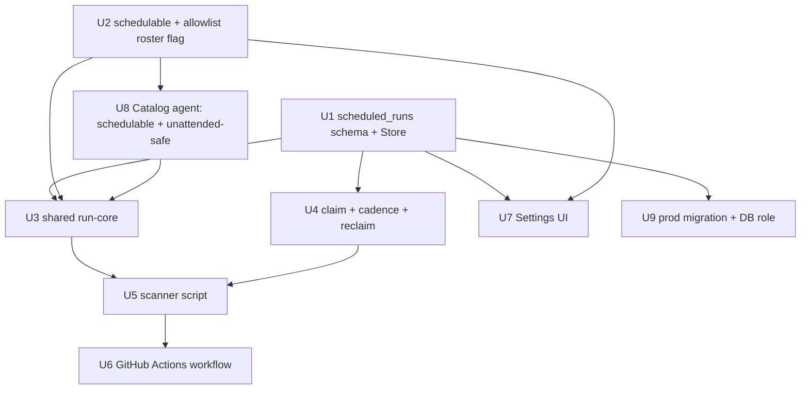

# feat: Scheduled, unattended agent runs (self-service, table-driven)

## Summary

Add a `scheduled_runs` table and a Settings "Scheduled runs" card where a user schedules an eligible agent to
run on a cadence using their own vault; a scheduled GitHub Actions workflow scans the table for due rows,
atomically claims each, drives the agent session to completion with an allowlist-gated auto-approve loop
(skip-and-record everything else), records the run as a session owned by the user, and advances the schedule.
The scan/claim/run/register/complete core is one shared function in the `lik_ui` package, invoked today by a
CI script over a direct DB connection and wrappable in an HTTP endpoint later without a rewrite. First use is
the Confluence catalog sync.

---

## Problem Frame

There is no way to run an agent on a cadence — every run is a manual, attended chat, so keeping the Catalog
fresh depends on someone remembering to trigger it. The hard part is running an agent with no human present
*safely*: supplying credentials, deciding what to do where the agent would normally pause, not double-running
or stranding jobs, and getting failures/skips to someone who will act. See origin for the full framing
(origin: docs/brainstorms/2026-07-27-03-scheduled-unattended-agent-runs-requirements.md).

This plan closely mirrors the near-twin that shipped 2026-07-28
([2026-07-28-001-feat-session-auto-delete-plan.md](docs/plans/2026-07-28-001-feat-session-auto-delete-plan.md)):
scheduled GitHub Action → OIDC → SSM secrets → direct prod-DB connection → standalone `lik-ui/scripts/`
script. The novel work here is the unattended drive-to-completion loop, the cron-like scheduling state, and
the self-service UI.

---

## Requirements

Traced to origin requirements (origin: docs/brainstorms/2026-07-27-03-scheduled-unattended-agent-runs-requirements.md):

- R1. Settings "Scheduled runs" section: create/view/edit/delete own schedules (agent + triggering message + cadence). → U7
- R2. A schedule runs as its creator, using that user's vault; own-schedules-only. → U1, U3, U7
- R3. `scheduled_runs` store records timing (next-due, in-flight, last start/complete); new table, non-destructive. → U1, U9
- R4. Each run's outcome (status + error/skip summary) is recorded on the schedule. → U1, U4
- R5. Scheduled GH workflow scans for due, not-in-flight rows and runs each. → U4, U5, U6
- R6. Claiming a due row is atomic (no double-run). → U4
- R7. Runner drives the session to completion as the owner, then records completion + next-due. → U3, U4
- R8. Each run is recorded as a session owned by the user (appears in Sessions, openable/resumable). → U3
- R9. Runner owns the stream loop; durable state is the table + session, not a lik-ui background task. → U3, U5
- R10. Hard max-runtime; a row stuck in-flight is detected, force-failed, made eligible again. → U4
- R11. Routine expected writes auto-approved by the runner (new server-side approve loop). → U3, U8
- R12. Ambiguous items (e.g. DO NOT USE) skipped-and-recorded; run always completes; no hang. → U3, U8
- R13. Only agents explicitly marked unattended-safe are schedulable (manual `schedulable` roster flag). → U2, U7, U8
- R14. Independent write backstop bounds unattended writes (allowlist). → U2, U3, U8
- R15. Auto-approval treats unexpected instruction-like content as ambiguous (skip). → U3 (allowlist denies unexpected tools)
- R16. Settings surfaces each schedule's connection health; warns when it can't authenticate. → U3, U7
- R17. Owner is actively notified on failure/skip (push, not pull). → U7 (in-app v1); push deferred (see Scope Boundaries)
- R18. The GH Action's credential to reach the table/start runs is explicit, rotatable, revocable, bounded. → U6, U9
- R19. A schedule's lifecycle is bound to its owner's access: schedules are paused/cancelled when the owner's
  vault is deleted or account deactivated, so a schedule cannot keep running unattended after access is
  revoked (raised in plan review). → U7 (delete-with-vault hook)

**Origin actors:** A1 scheduling user, A2 scanner/runner (GitHub Actions), A3 `scheduled_runs` table, A4 agent.
**Origin flows:** F1 create a schedule, F2 scan and run due schedules, F3 review/resolve a run.
**Origin acceptance examples:** AE1 (R1,R2,R8), AE2 (R5,R6), AE3 (R10), AE4 (R11,R12), AE5 (R16,R17), AE6 (R13).

---

## Scope Boundaries

- High-frequency / sub-cadence scheduling — out; granularity is bounded by the GitHub Action's own cron.
- Scheduling on another user's behalf or shared team schedules — out; own-creator only.
- A dedicated service/bot account for runs — out; each run uses its creator's vault.
- Authoring arbitrary agents to be unattended-safe — out; per-agent skill work, gated by the `schedulable` flag.
- The TTL column and routine-vs-full-sweep skill split — out; owned by the catalog-refresh-TTL work. This
  plan supplies only the trigger/cadence.

### Deferred to Follow-Up Work

- **True push notifications (R17 full satisfaction):** email via SES or a Slack webhook. v1 is in-app only
  (Settings badge + recorded outcome), which only partially satisfies R17 — push is a separate follow-up
  once a notification channel is chosen and (for email) SES is provisioned.
- **Cron-expression cadences:** v1 supports a small set of preset intervals (e.g. hourly/daily/weekly); free
  cron expressions are a later enhancement.
- **HTTP endpoint transport / future CLI:** the shared core is built to be endpoint-wrappable, but no endpoint
  or CLI is built now (origin Key Decision).

---

## Context & Research

### Relevant Code and Patterns

- **Near-twin to mirror:** [2026-07-28-001-feat-session-auto-delete-plan.md](docs/plans/2026-07-28-001-feat-session-auto-delete-plan.md),
  `lik-ui/scripts/prune_sessions.py`, `.github/workflows/prune-sessions.yml` — scheduled GHA + OIDC→SSM→direct
  DB + standalone script constructing `Store`/`AnthropicSessionsClient`. Commit `ce4975e` (non-destructive
  column-add), `356a315` (timezone-robust `timestamptz` tests — compare instants, not offset strings).
- **DB layer:** `lik-ui/src/lik_ui/db.py` — `Database` (pool) + `Store` (queries); raw SQL with `%s`, each
  write calls `conn.commit()`; ownership-scoped by `user_id`. `list_sessions_due(cutoff)` (db.py:181) is the
  precedent cross-user scheduled query; `take_pending_client` (db.py:98) is the nearest single-statement
  claim (`DELETE … RETURNING`). Schema in `lik-ui/db/init.sql` (all `CREATE TABLE IF NOT EXISTS`); the
  `sessions.auto_delete_at` block (init.sql:39-48) is the canonical add-a-thing example.
- **Session client (reusable, web-free):** `lik-ui/src/lik_ui/chat.py` — `SessionsClient` Protocol /
  `AnthropicSessionsClient`: `create_session`, `send_and_stream` (yields normalized events; ends `{"type":
  "done"}` or `{"type":"awaiting_confirmation","event_ids":[...]}`), `confirm_and_stream(tool_use_id, result,
  session_thread_id)`. Registration = `create_session` (platform) + `Store.create_session` (row), see
  `new_chat` (chat.py:391-398). `lik-ui/scripts/smoke.py` `stage_session` (smoke.py:103) is the closest
  non-interactive skeleton (but ignores confirmations).
- **Settings page:** `lik-ui/src/lik_ui/account.py` (`register_account_routes`) renders
  `lik-ui/src/lik_ui/templates/settings.html` — stack of `<div class="card">`; CRUD is plain
  `POST → mutate via Store → 303 redirect` (see `delete_credential`/`delete_all_sessions`, account.py:64-94).
- **Auth / identity:** `lik-ui/src/lik_ui/app_auth.py` (`require_user`, Google OIDC, identity in signed
  cookie); `lik-ui/src/lik_ui/vault.py` `ensure_user_vault(store, vault_client, user)` (vault.py:163, web-free,
  self-heals) resolves user→vault. `dev-login` (app_auth.py:155) shows seeding user+vault without a request.
- **Roster:** `lik-ui/src/lik_ui/agents.toml` (`[[agents]]` by name; Catalog Registration Agent already
  present, agents.toml:51). `user_prompt` (commit `07c8b85`) is the template for threading a new roster field
  through `settings.py` (`AgentRosterEntry`/`AgentOption`) and `agents.py` (`resolve_agent_options`).
- **CI/infra:** `.github/workflows/prune-sessions.yml` (blueprint), `infra/iam_github_oidc.tf` (SSM-read role
  grants `/ik-arch/prod/shared/ANTHROPIC_API_KEY` + `DB_MASTER_PASSWORD`; trust scoped to
  `environment:prod`), `infra/ssm.tf`. Local lik-ui DB is port **5433** (5432 is lik-mcp).

### Institutional Learnings

- **docs/oauth.md:** Atlassian purges its DCR client after some days, killing access + refresh tokens; only
  interactive re-auth fixes it → a recurring Confluence sync *will* periodically fail on lapsed auth. Detect
  via `mcp_authentication_failed_error` / `session.error` in the event stream. This is a normal recurring
  outcome (R16/R17), not an edge case.
- **docs/deploy-runbook.md:** `environment: prod` must exist or the OIDC `sub` silently reverts to the branch
  form and role assumption fails cryptically. `init.sql` re-run will not create/alter on the existing prod DB
  — prod migration is a separate manual step.
- **docs/brainstorms/2026-07-27-02-catalog-refresh-due-ttl-spike-results.md:** the Catalog agent goes silent
  60–90s between tool batches and a full sync is minutes-long → size max-runtime and stuck-row reclaim
  generously; "no events for 90s" ≠ dead run.
- **docs/solutions/architecture-patterns/sse-streaming-behind-idle-timeout-proxy-2026-07-27.md:** the browser
  SSE heartbeat/resume does NOT apply to the CI runner (it owns its own loop, not behind the proxy) — read
  only for the timing reality.

### External References

- None — local patterns are strong (the auto-delete twin is directly reusable). External research skipped.

---

## Key Technical Decisions

- **Direct-DB transport for the scanner**, credentials from SSM via OIDC — the established house pattern
  (prune-sessions already connects to prod DB from CI). The prod DB is already public (verified), so this adds
  no new network exposure (origin, accepted risk). A dedicated table-scoped DB role (only `scheduled_runs` +
  `sessions`) is a **required** least-privilege control (U9) — the scanner never connects with the master
  credential.
- **Shared core function** in `lik_ui`, shaped like `prune_due_sessions(store, sessions_client, …)` — takes
  store/clients + a run row, derives user/vault internally, no `Request`/cookie. CI calls it directly; a
  future endpoint calls the same function. This is what makes "direct DB vs endpoint" a transport choice over
  one implementation (origin, avoids two writers / schema drift).
- **Allowlist auto-approve unifies R11/R14/R15.** On `awaiting_confirmation`, the runner allows the paused
  tool call only if its `(server, tool name)` is on the agent's configured allowlist; otherwise it denies and
  records the skip. This is simultaneously the auto-approve policy (R11), the independent write backstop (R14
  — writes are bounded to allowlisted tools regardless of the skill's own judgment), and the injected-content
  defense (R15 — an injected "call some other tool" isn't allowlisted → skipped). Denying is also how DO NOT
  USE hold-backs (R12) resolve headlessly, which requires the skill to treat a deny as skip-and-continue (R10
  authoring, gated by R13). Allowlist entries are stored as **`(server, tool_name)` pairs** (never bare names)
  to avoid cross-server tool-name collisions. **Two caveats the mechanism does NOT cover:** (a) it is an
  *identity* backstop, not a *content* one — an allowlisted call (e.g. `register_catalog_entry`) with
  attacker-poisoned arguments sourced from an editable Confluence page still auto-approves; argument/content
  validation is the skill's responsibility (accepted residual risk, in Risks). (b) It only sees tool calls
  that actually pause; a write tool whose server is configured `always_allow` never pauses and bypasses the
  allowlist entirely — so U8 must verify every write tool the Catalog agent can call is gated `ask`.
- **Store the agent *name* (not id) on the run row**; the scanner resolves name→id at run time via
  `resolve_agent_options` — consistent with the repo's "no platform ids pinned" convention.
- **Atomic claim** via `UPDATE scheduled_runs SET started_at = now(), … WHERE id = %s AND started_at IS NULL
  RETURNING …` in one connection; a null return means the claim was lost. Plus workflow-level
  `concurrency: cancel-in-progress: false`. Belt and suspenders for R6.
- **In-app notification for v1** (Settings badge + recorded outcome + health); true push deferred. Partially
  satisfies R17.
- **Preset-interval cadence for v1** (e.g. hourly/daily/weekly); `next_run_at` advances from scan time on
  completion. Cron expressions deferred.

---

## Open Questions

### Resolved During Planning

- Transport (direct-DB vs endpoint): **direct-DB**, per house pattern + accepted public-DB risk.
- Auto-approve policy / write backstop / injection defense: **one allowlist mechanism** (see Key Decisions).
- Agent id on the row: **store name, resolve in CI**.
- Notification channel: **in-app v1**, push deferred (user decision).
- Cadence expression: **preset intervals v1**, cron deferred.

### Deferred to Implementation

- Exact `scheduled_runs` column set and types (working names in U1) — finalize when writing the migration.
- The per-agent `max_runtime` values (set in the roster per U2/U8) and the finalize `margin` — the invariant
  `stuck_cutoff = max_runtime + margin` is fixed in U4; the numbers are tuned per agent after observing real
  run durations (the Catalog full sync, given 60–90s silent windows). Also the deny-loop threshold K (U3).
  The default `max_runtime` fallback for agents that omit it.
- Live-verify the `awaiting_confirmation.event_id → tool_use.id` correlation against the real SDK before
  relying on it (U3) — `smoke.py` never exercises a confirmation today.
- Exact allowlist contents for the Catalog Registration Agent (which `(server, tool)` pairs count as routine)
  — determine from the sync skill's actual tool calls (`register_catalog_entry`, list/query tools) during U8.
- Whether preset intervals are stored as an interval value or a small enum — a UI/schema detail for U1/U7.

---

## High-Level Technical Design

> *This illustrates the intended approach and is directional guidance for review, not implementation
> specification. The implementing agent should treat it as context, not code to reproduce.*

**Unit dependency graph:**



**Shared run-core loop (per claimed row) — directional:**

```
run_scheduled(store, sessions_client, vault_client, agents, row):
    user  = resolve user {id, email} from row.user_id
    vault = ensure_user_vault(store, vault_client, user)
    agent = resolve row.agent_name -> (agent_id, environment_id, allowlist) via `agents`
    session_id = sessions_client.create_session(agent_id, environment_id, [vault], title)
    store.create_session(user.id, agent_id, session_id, title)   # appears in owner's Sessions
    skipped = []
    seen_tool_uses = {}          # id -> {id, server, name, session_thread_id}
    deny_counts = {}             # (server,name) -> count, for the deny-loop guard
    events = send_and_stream(session_id, row.prompt), drained via a WATCHDOG
             (daemon thread + queue.get(timeout=slice) so a silent stream can't block past max-runtime)
    loop until done / error / max-runtime budget exhausted:
        event = next event, or WATCHDOG timeout -> outcome = timed_out; break
        if event is tool_use: seen_tool_uses[event.id] = {server, name, session_thread_id}
        on {"done"}: outcome = success; break
        on {"awaiting_confirmation", event_ids}:   # NOTE: a batch pause carries MANY ids
            for eid in event_ids:                  # must answer EVERY pending id or the turn never resumes
                tc = correlate eid -> seen_tool_uses  (mapping verified against live SDK in U3)
                if (tc.server, tc.name) in agent.allowlist:
                    confirm_and_stream(session_id, tc.id, "allow", tc.session_thread_id)
                else:
                    if ++deny_counts[(tc.server,tc.name)] > K: outcome = deny_loop; break outer
                    confirm_and_stream(session_id, tc.id, "deny", tc.session_thread_id)
                    skipped.append({tc.server, tc.name})
        on error event with error_type == mcp_authentication_failed_error: outcome = auth_lapsed; break
        on other session.error (often benign, e.g. unconnected server): record, keep draining
    if outcome in {auth_lapsed, timed_out, deny_loop, failed} and no usable transcript:
        store.delete_session(session_id, user.id)   # don't leave an empty session in the owner's list
    return outcome, skipped     # caller records on the row (R4) and advances next_run_at (R7)
```

**Scan orchestration (the CI script's inner call) — directional:**

```
for row in store.claim_due_runs(now, stuck_cutoff):   # atomic claim; also reclaims stuck rows
    try:    outcome, skipped = run_scheduled(...)
    except: outcome = failed
    finally:
        if outcome == auth_lapsed: store.pause_and_flag(row.id, "needs_reauth")   # don't hammer every cadence
        else:                      store.complete_run(row.id, outcome, skipped, next_run_at = now + row.interval)
return 1 if any outcome in {failed, timed_out, auth_lapsed, deny_loop} else 0
```

---

## Implementation Units

- U1. **`scheduled_runs` schema + Store methods**

**Goal:** Persist schedules and their timing/outcome; add the query surface the UI and scanner need.

**Requirements:** R2, R3, R4

**Dependencies:** None

**Files:**
- Modify: `lik-ui/db/init.sql` (new `CREATE TABLE IF NOT EXISTS scheduled_runs`)
- Modify: `lik-ui/src/lik_ui/db.py` (Store methods)
- Modify: `lik-ui/tests/conftest.py` (add `scheduled_runs` to `_TABLES` truncation list)
- Test: `lik-ui/tests/test_scheduled_runs_store.py`

**Approach:**
- Columns (working names, finalize in migration): `id`, `user_id` (FK/owner), `agent_name`, `prompt`,
  `interval` (preset cadence), `next_run_at timestamptz`, `started_at timestamptz NULL`, `completed_at
  timestamptz NULL`, `last_status`, `last_error`, `last_skipped` (JSON/text), `paused bool`, `pause_reason`
  (e.g. `needs_reauth`, set by U4 auto-pause for the R16 badge), `created_at`.
- Store methods: `create_scheduled_run`, `list_scheduled_runs(user_id)` (owner-scoped, for UI),
  `delete_scheduled_run(id, user_id)`, `set_scheduled_run_paused(id, user_id, paused)`. Cross-user
  claim/complete live in U4. Each write commits (db.py convention). Add `get_user_by_id` (only
  `get_user_by_email` exists) so the scanner can resolve `user_id → {id,email}`.
- `timestamptz` throughout; compare instants in tests (learning `356a315`).

**Patterns to follow:** `sessions` table block (init.sql:39-48); `create_session`/`get_session` owner-scoping
(db.py); `list_sessions_due` cross-user precedent.

**Test scenarios:**
- Happy path: create a scheduled run → `list_scheduled_runs(owner)` returns it with the set cadence/next-due.
- Edge case: `list_scheduled_runs` for a user returns only that user's rows (ownership scoping).
- Edge case: `delete_scheduled_run(id, other_user)` deletes nothing (owner-scoped WHERE).
- Happy path: `get_user_by_id` returns `{id,email}` for a known id; `None` for unknown.
- Integration: after `create_scheduled_run`, a fresh `Store` reads it back (commit actually persisted).

**Verification:** New table created by `init.sql` on a fresh test DB; all Store methods owner-scoped; conftest
truncation includes the table.

---

- U2. **`schedulable` + `auto_approve` allowlist roster fields**

**Goal:** Mark which agents may be scheduled and what tool calls the runner may auto-approve for each.

**Requirements:** R13, R14

**Dependencies:** None

**Files:**
- Modify: `lik-ui/src/lik_ui/agents.toml`
- Modify: `lik-ui/src/lik_ui/settings.py` (`AgentRosterEntry`, `AgentOption`, `agent_roster` parsing)
- Modify: `lik-ui/src/lik_ui/agents.py` (`resolve_agent_options`)
- Test: `lik-ui/tests/test_agents_roster.py` (extend if present, else create)

**Approach:**
- Thread the fields exactly as `user_prompt` was threaded (commit `07c8b85`): `schedulable: bool = False`,
  `auto_approve` (allowlist of **`(server, tool_name)` pairs** — always server-qualified, never bare names, so
  a same-named tool on a different MCP server is not accidentally auto-approved), and **`max_runtime`** (a
  per-agent bound, since agents vary wildly in duration; the curator who marks an agent unattended-safe also
  knows its typical run length) on both `AgentRosterEntry` and `AgentOption`, parsed in `agent_roster`, passed
  in `resolve_agent_options`. `max_runtime` has a sensible fallback default when omitted.
- Also thread **`agent_name`** onto `AgentOption` (it currently carries only `agent_id`/`environment_id`/…).
  The scanner resolves a `scheduled_runs.agent_name` by matching it against `AgentOption.agent_name`; without
  this field the run-core (U3) has nothing to match the stored name against.
- The UI filters `app.state.agents` to `schedulable` (mirrors `is_management` filtering). The scanner reads
  the same resolved options (it constructs `Settings()` + `resolve_agent_options` itself — no `app.state`).

**Patterns to follow:** `user_prompt` threading across settings.py/agents.py; `is_management` filtering
(app_auth.py:223).

**Test scenarios:**
- Happy path: an agent with `schedulable = true` parses to `AgentOption.schedulable == True`; default is False.
- Happy path: `auto_approve` of `(server, tool_name)` pairs parses onto the option as server-qualified pairs.
- Happy path: `AgentOption.agent_name` carries the roster name (resolvable by the scanner).
- Edge case: omitted fields default to `False` / `[]` without error.

**Verification:** Roster fields flow to `AgentOption`; defaults safe.

---

- U3. **Shared unattended run-core (drive-to-completion + allowlist approve/skip + outcome)**

**Goal:** The reusable heart: run one schedule's session to completion as its owner, auto-approving allowlisted
tool calls, skip-and-recording the rest, detecting auth-lapse, registering the session, returning an outcome.

**Requirements:** R2, R7, R8, R9, R11, R12, R14, R15, R16

**Dependencies:** U1, U2, U8 (allowlist values)

**Files:**
- Create: `lik-ui/src/lik_ui/scheduled_runner.py` (the shared core; importable by CI and a future endpoint)
- Test: `lik-ui/tests/test_scheduled_runner.py`

**Approach:**
- Signature shaped like `prune_due_sessions`: `run_scheduled(store, sessions_client, vault_client, agents,
  row) -> RunOutcome`. Resolve `user_id → {id,email}` (U1 `get_user_by_id`) → `ensure_user_vault` →
  resolve `row.agent_name` to `(agent_id, environment_id, allowlist)` from `agents`.
- Create platform session + `Store.create_session` row (R8, exact sequence from `new_chat`), then
  `send_and_stream(prompt)`. Buffer streamed `tool_use` events by id.
- **Batched confirmations:** a single `awaiting_confirmation` can carry *many* `event_ids` (the Catalog
  agent emits tool batches). The loop must answer **every** pending `event_id` before re-reading the stream —
  confirming only one leaves the turn paused forever. For each id, correlate `event_id → buffered tool_use`
  to recover `(server, name, id, session_thread_id)`, then `confirm_and_stream("allow")` iff `(server, name)`
  is in the allowlist else `("deny")` + record skip; echo `session_thread_id`. **The `event_id → tool_use`
  correlation must be pinned with a live smoke run** — `smoke.py` never exercises a confirmation, so the
  mapping is currently unverified.
- **Deny-loop guard:** if the same `(server, name)` is denied more than K times in a run (a retry-happy agent
  re-requesting a denied tool), abort with outcome `deny_loop`. Do not rely on the skill to stop retrying.
- **Error classification:** only an error event whose `error_type == mcp_authentication_failed_error` →
  outcome `auth_lapsed` (R16). Other `session.error` events are often benign (e.g. an unconnected MCP server
  streams an error and the agent still answers, per chat.py) — record them but keep draining to `done`.
- **Watchdog for max-runtime:** the budget is the resolved agent's per-agent `max_runtime` (U2). Because
  `send_and_stream` is a blocking generator, a wall-clock check between events cannot fire during the
  documented 60–90s silent windows — so drain the stream on a daemon thread with a `queue.get(timeout=…)`
  (mirror `chat.py._sse`) or set a socket read-timeout, so a silent/hung stream still yields outcome
  `timed_out` (R10 support; row reclaim itself is U4).
- **No empty sessions:** when a run produces no usable transcript (immediate `auth_lapsed`, create failure,
  `timed_out` before any content), delete the just-created session row (owner-scoped, as chat.py does on
  `SessionNotFound`) so recurring failures don't accumulate empty sessions in the owner's list. Record the
  outcome on the schedule row regardless. Return outcome + skipped list for the caller to persist (R4).
- Guard `sessions_client is None` (stub mode) so the DB-only path is testable without the platform.

**Execution note:** Implement the approve/skip decision test-first — it is the safety-critical core (R11/R14/R15).

**Technical design:** see High-Level Technical Design (run-core loop). Directional only.

**Patterns to follow:** `new_chat` registration sequence (chat.py:391-398); `AnthropicSessionsClient`
confirm/stream protocol; `smoke.py` `stage_session` non-interactive skeleton; `prune_due_sessions` shape.

**Test scenarios:**
- Covers AE4. Happy path: a fake `SessionsClient` streams a `tool_use` for an allowlisted tool then
  `awaiting_confirmation` → runner calls `confirm_and_stream(..., "allow")` and the run reaches `done` with
  outcome success, no skips.
- Covers AE4. Error path: a paused tool NOT on the allowlist → runner calls `confirm_and_stream(..., "deny")`,
  records the tool in `skipped`, and the run still completes.
- Edge case: a single `awaiting_confirmation` carrying **two** `event_ids` (batch) → both are answered before
  the stream is re-read, and the run reaches `done` (asserts the batch does not hang).
- Edge case: injected/unexpected tool name (not allowlisted) → denied + recorded (R15) — same mechanism, asserts
  an unknown tool never auto-approves.
- Error path: a fake client that re-requests a denied tool repeatedly → after K denies of the same
  `(server,name)`, outcome `deny_loop`, no infinite loop.
- Covers AE5. Error path: an error event with `error_type == mcp_authentication_failed_error` → outcome
  `auth_lapsed`, no crash.
- Error path: a benign `session.error` (e.g. unconnected server) followed by more events → the run keeps
  draining and reaches `done` (NOT mis-classified as `auth_lapsed`).
- Edge case: a fake client whose stream stalls silently with no further events → the watchdog fires and the
  runner returns `timed_out` rather than blocking.
- Integration: on start, `Store.create_session` is called with `(user_id, agent_id, session_id, title)` so the
  run is owner-visible (R8).
- Integration: a no-transcript failure (immediate `auth_lapsed`) → the just-created session row is deleted
  (no empty-session pileup).
- Edge case: `session_thread_id` present on a paused subagent tool call is echoed back on confirmation.

**Verification:** Given a scripted fake client, the runner drives allow/deny correctly, records skips and
auth-lapse, registers the session, and never hangs.

---

- U4. **Atomic claim, cadence advancement, and stuck-row reclaim**

**Goal:** The scheduler semantics: select due rows, claim atomically, advance `next_run_at` on completion,
reclaim rows stuck in-flight past max-runtime.

**Requirements:** R4, R5, R6, R7, R10

**Dependencies:** U1

**Files:**
- Modify: `lik-ui/src/lik_ui/db.py` (`claim_due_runs`, `complete_run`)
- Test: `lik-ui/tests/test_scheduled_runs_claim.py`

**Approach:**
- `claim_due_runs(now, stuck_cutoff)`: single-statement claim — `UPDATE scheduled_runs SET started_at = now()
  … WHERE (started_at IS NULL AND next_run_at <= %s AND NOT paused) OR (started_at < %s /*stuck_cutoff*/ AND
  completed_at IS NULL) RETURNING *`. The stuck branch reclaims rows whose runner died (started but never
  completed) so they run again (R10). Cross-user (like `list_sessions_due`).
- **Invariant (prevents double-running a live runner):** `stuck_cutoff` must be strictly greater than the
  **agent's configured `max_runtime`** (from the roster, per U2) plus a finalize margin — `stuck_cutoff =
  max_runtime + margin`, derived *per agent* (do NOT tune independently, and do NOT use one global cutoff for
  agents with different `max_runtime`s). Otherwise the stuck branch reclaims a row whose runner is still
  legitimately mid-sync and re-runs the same schedule concurrently as the same user. Add a test asserting a
  row younger than its agent's `stuck_cutoff` is never reclaimed even while in-flight.
- When the stuck branch reclaims a row, first record a `timed_out`/`abandoned` outcome for the dead run
  (so the prior failure is surfaced to the owner) before re-running.
- `complete_run(id, status, error, skipped, next_run_at)`: sets `completed_at = now()`, clears `started_at`,
  records outcome (R4), and sets the next due time = completion time + interval (R7).
- `pause_and_flag(id, reason)`: on `auth_lapsed`, pause the schedule and flag `needs_reauth` instead of
  advancing `next_run_at` — a lapsed-auth schedule must not re-fail every cadence (only interactive re-auth
  fixes it). Re-authenticating (or the user un-pausing) resumes it. The Settings badge (U7) shows the flag.
- Unresolvable `agent_name` at scan time (agent renamed/removed from the roster since scheduling) is a
  recorded run failure with a clear status, not a crash.
- Rely on the `RETURNING` set for what this scan claimed; a row not returned was already claimed elsewhere (R6).

**Test scenarios:**
- Covers AE2. Integration: two sequential `claim_due_runs` calls on the same due row → the first returns it,
  the second does not (atomic claim; simulates overlap).
- Covers AE3. Edge case: a row with `started_at` older than `stuck_cutoff` and `completed_at` null is returned
  by `claim_due_runs` (reclaimed) and can complete.
- Edge case: a row in-flight but *younger* than `stuck_cutoff` is NOT reclaimed (the invariant that prevents
  double-running a live runner).
- Happy path: `complete_run` sets `next_run_at = completion + interval`, clears `started_at`, records status.
- Happy path: `pause_and_flag` on an `auth_lapsed` outcome pauses the row and sets `needs_reauth`, and does
  NOT advance `next_run_at`.
- Edge case: a paused row is never claimed even when due.
- Edge case: a row not yet due (`next_run_at` in future) is not claimed.

**Verification:** Due, non-paused, non-in-flight rows are claimed exactly once; stuck rows are reclaimed;
completion advances the schedule.

---

- U5. **CI scanner script**

**Goal:** The standalone entrypoint the workflow runs: build store/clients, scan+run, exit nonzero on failure.

**Requirements:** R5, R9

**Dependencies:** U3, U4

**Files:**
- Create: `lik-ui/scripts/run_scheduled.py`
- Test: `lik-ui/tests/test_run_scheduled_script.py` (light — smoke of `main()` wiring with a stub client)

**Approach:**
- Mirror `prune_sessions.py` `main()`: `Settings()` → `Store(Database(settings.conninfo))` →
  `resolve_agent_options(settings, agents_client)` → `AnthropicSessionsClient(...)` + vault client → loop
  `claim_due_runs` → `run_scheduled` (U3) in try/except → `complete_run` in finally → `return 1` if any
  outcome failed/timed_out/auth_lapsed → `finally: store.db.close()`.
- No `require_production_config`/web app (twin does the same). Reads DB config from `LIK_UI_*` env (port
  overridden per environment).

**Patterns to follow:** `lik-ui/scripts/prune_sessions.py` (`main`, try/finally, nonzero exit).

**Test scenarios:**
- Happy path: with a stub sessions client and one due row, `main()` claims, runs, completes, returns 0.
- Error path: a run that raises → row still completed with a failure status; `main()` returns 1.
- Edge case: no due rows → returns 0, no session created.

**Verification:** `uv run python scripts/run_scheduled.py` (against a test DB) claims and processes due rows and
surfaces failures via exit code.

---

- U6. **Scheduled GitHub Actions workflow**

**Goal:** Run the scanner on a cadence with OIDC→SSM creds and overlap protection.

**Requirements:** R5, R18

**Dependencies:** U5, U9 (the scoped DB role must exist before this workflow runs against prod)

**Files:**
- Create: `.github/workflows/scheduled-runs.yml`

**Approach:**
- Copy `prune-sessions.yml` almost verbatim: `on: schedule: cron` + `workflow_dispatch`; `concurrency:
  cancel-in-progress: false`; `permissions: id-token: write, contents: read`; `environment: prod`; checkout →
  setup-uv → configure-aws-credentials with `vars.AWS_SSM_READ_ROLE_ARN` → `aws ssm get-parameter
  --with-decryption` + `::add-mask::` + `$GITHUB_ENV` → `uv run python scripts/run_scheduled.py` with
  `working-directory: lik-ui` and `LIK_UI_*` env from `vars.*` + `LIK_UI_DB_SSLMODE: require`.
- **The DB password comes from the scoped-role credential (U9), NOT `DB_MASTER_PASSWORD`.** R18's "bounded"
  criterion depends on this — the scanner must never connect with the master credential. Sources
  `ANTHROPIC_API_KEY` and the scoped DB role's password from SSM (the scoped-role param requires the SSM-read
  role to grant it; coordinate with U9).

**Test scenarios:** Test expectation: none — CI config; validated by a manual `workflow_dispatch` run against
prod after U9.

**Verification:** Manual dispatch assumes the OIDC role, fetches secrets, connects to the DB, and runs the
scanner to a clean exit; scheduled trigger fires on cadence; overlapping ticks do not double-run (concurrency
+ atomic claim).

---

- U7. **Settings "Scheduled runs" UI**

**Goal:** Self-service CRUD for schedules, showing last outcome and connection health.

**Requirements:** R1, R2, R13, R16, R17 (in-app portion), R19

**Dependencies:** U1, U2

**Files:**
- Modify: `lik-ui/src/lik_ui/account.py` (routes)
- Modify: `lik-ui/src/lik_ui/templates/settings.html` (new card)
- Test: `lik-ui/tests/test_account_scheduled_runs.py`

**Approach:**
- New `<div class="card">` "Scheduled runs": a create form (agent select filtered to `schedulable`, cadence
  preset, optional prompt) and a list of the user's schedules showing cadence, `next_run_at`, last status,
  and a badge — including a **"needs re-authentication"** badge when the last outcome was `auth_lapsed` (R16)
  and a **failed/skipped** indicator (in-app R17).
- Routes mirror `delete_credential`/`delete_all_sessions`: `POST /settings/scheduled-runs` (create),
  `POST /settings/scheduled-runs/{id}/delete`, `POST /settings/scheduled-runs/{id}/pause` — each
  `require_user`, mutate via Store scoped to `user["id"]`, then `303 → /settings`.
- Reuse the resolved `app.state.agents` filtered to `schedulable` for the picker (AE6).
- **Lifecycle (R19):** when the owner deletes their credential/vault (existing `delete_credential`,
  account.py:64) or the account is deactivated, cascade to their schedules — delete or pause them so a
  schedule cannot keep running with revoked access. Simplest: a `Store` call that removes/pauses the user's
  `scheduled_runs` invoked from the same handler that clears the vault.

**Test scenarios:**
- Covers AE1. Happy path: POST create as a logged-in user → row created for that user; appears in the list.
- Covers AE6. Edge case: the agent picker only offers `schedulable` agents (a non-schedulable agent is absent).
- Edge case: `require_user` gate — unauthenticated POST redirects to login; a user cannot delete/pause another
  user's schedule (owner-scoped Store call affects nothing).
- Covers AE5. Happy path: a schedule whose last outcome is `auth_lapsed` renders the "needs re-auth" badge.
- Happy path: a schedule with a failed/skipped last run renders the failure/skip indicator.
- Covers R19. Integration: deleting the owner's credential/vault removes (or pauses) that owner's schedules;
  a subsequent scan does not run them.

**Verification:** A user can create, list, pause, and delete their own schedules; only schedulable agents are
offered; health/failure surfaces in-app.

---

- U8. **Catalog Registration Agent: mark schedulable, unattended-safe, allowlist**

**Goal:** Enable the first real schedule and ensure its skill behaves under headless deny (skip-and-record).

**Requirements:** R12, R13, R14

**Dependencies:** U2

**Files:**
- Modify: `lik-ui/src/lik_ui/agents.toml` (Catalog Registration Agent: `schedulable = true`, `auto_approve =
  [...]`, `max_runtime = <generous bound for a full sync>`)
- Modify: `claude_platform/skills/sync-catalog-from-project-indexes/SKILL.md` (unattended-safe defaults if not
  already explicit: on a denied/withheld confirmation, skip-and-record and continue; never wait indefinitely)

**Approach:**
- Set the allowlist to exactly the sync's routine write/read tools (e.g. `register_catalog_entry` and the
  list/query tools it uses) so those auto-approve and everything else (including a DO NOT USE hold-back or an
  injected tool call) is denied → skipped (R12/R14/R15).
- Verify the SKILL.md already skips DO NOT USE and doesn't block on missing confirmation; make the unattended
  behavior explicit if needed (R10 authoring). Keep store-agnostic (no Confluence-only assumptions in the
  runner).
- **Verify every write tool the Catalog agent can call is gated `ask`, not server-side `always_allow`** —
  otherwise those writes never pause and bypass the allowlist backstop entirely (R14). Check via
  `agents_client.describe(agent_id)` per-server `permission_policy`.

**Test scenarios:** Test expectation: none for the roster flag (covered by U2/U3 mechanics). If SKILL.md
behavioral defaults change, the behavior is exercised by U3's allow/deny scenarios; no separate code test.

**Verification:** The Catalog Registration Agent appears as schedulable; its allowlist matches the sync's
routine tools; the skill skips-and-records on a denied confirmation rather than hanging.

---

- U9. **Production migration + least-privilege DB role**

**Goal:** Create the table on prod safely and give CI a table-scoped credential (R18 least-privilege).

**Requirements:** R3, R18

**Dependencies:** U1

**Files:**
- Modify: `docs/deploy-runbook.md` (record the manual prod migration step)
- Modify: `infra/` (a dedicated Postgres role scoped to `scheduled_runs` + `sessions`; store its password in
  SSM and grant the SSM-read OIDC role access to that param)

**Approach:**
- Apply `CREATE TABLE IF NOT EXISTS scheduled_runs` to `lik-prod-db` as a separate manual step (init.sql re-run
  will not create it on the existing prod DB). Non-destructive; no drop/recreate (CLAUDE.md).
- **Provision a dedicated DB role with grants only on `scheduled_runs` and `sessions`** for the scanner —
  required, not optional. This is R18's "bounded" criterion; the scanner must connect with this role, never
  `DB_MASTER_PASSWORD`, so a compromise of the CI credential cannot read/write the whole DB over the public
  endpoint. Store the role's password in SSM and grant the SSM-read role access to that parameter; U6 sources
  it. (If for any reason the scoped role is not landed, R18 is only partially satisfied — say so explicitly
  rather than shipping the master credential silently.)

**Test scenarios:** Test expectation: none — ops/migration. Verified by confirming the table exists on prod and
the scanner connects with the scoped role.

**Verification:** `scheduled_runs` exists on prod; the scanner connects and operates with a credential limited
to the two tables (if the scoped role is adopted).

---

## System-Wide Impact

- **Interaction graph:** New scanner path reuses `AnthropicSessionsClient` + `Store.create_session` +
  `ensure_user_vault` exactly as the web chat path does, so scheduled sessions are indistinguishable from
  interactive ones in `/sessions`. The new server-side approve loop is a *second* consumer of the
  `awaiting_confirmation`/`confirm_and_stream` protocol (the browser is the first) — keep the protocol
  contract stable.
- **Error propagation:** Run failures (agent error, auth-lapse, timeout) are recorded on the row and surfaced
  by the scanner's nonzero exit (job-level) and the Settings badge (owner-level, in-app). They must not crash
  the scan loop for other rows (per-row try/except).
- **State lifecycle risks:** A crashed runner leaves `started_at` set with no `completed_at`; the stuck-row
  reclaim (U4) is the guard. Double-run is prevented by atomic claim + workflow concurrency.
- **API surface parity:** The shared core is the seam an HTTP endpoint (or CLI) would reuse; keep it
  request-free so parity is a wrapper, not a fork.
- **Unchanged invariants:** No change to interactive chat, existing session listing/ownership, vault
  provisioning, or the deploy workflows. `sessions` table gains scheduled-origin rows but its schema is
  unchanged.

---

## Risks & Dependencies

| Risk | Mitigation |
|------|------------|
| Atlassian DCR purge silently kills the owner's Confluence auth → recurring sync failures | Detect `mcp_authentication_failed_error` → outcome `auth_lapsed`; surface "needs re-auth" badge (R16). Accepted as a recurring, expected outcome (oauth.md), not a bug to fix here. |
| In-app-only notification means an owner may not notice a failed/skipped run promptly | Documented partial satisfaction of R17; push (email/Slack) is the first Deferred follow-up. Job-level failure still visible in GitHub Actions. |
| A mis-flagged `schedulable` agent that isn't truly unattended-safe hangs or writes unexpectedly | The allowlist backstop (R14) bounds writes regardless of skill judgment; deny-on-non-allowlisted prevents unexpected auto-writes; max-runtime prevents indefinite hang. Flag is human-curated (R13). |
| Long silent windows (60–90s) look like a dead run | Size max-runtime and stuck-cutoff generously (learning); don't treat silence as death. |
| Direct DB connection from CI uses a broad credential | **Required** table-scoped DB role (U9), never the master credential; DB already public (accepted risk). |
| Scanner's shared credentials (Anthropic API key + DB) can run sessions as *any* scheduled user if the CI workflow/secret is compromised — larger blast radius than one user session | Accepted, mitigated by OIDC trust-scoping (`environment: prod` + default-branch policy), the scoped DB role, and secret masking; the API key is not exposed to GitHub logs. Larger blast radius is inherent to a cross-user scanner. |
| Allowlisted-write content poisoning: an attacker editing a Confluence page can drive an allowlisted `register_catalog_entry` with malicious arguments (the allowlist checks tool identity, not content) | Accepted residual risk; content/argument validation is the skill's responsibility (R15 covers unexpected *tool calls*, not poisoned args to expected ones). Documented so it isn't mistaken for covered. |
| `prod` GitHub environment misconfig breaks OIDC silently | Confirm `environment: prod` exists before wiring (deploy-runbook). |

---

## Documentation / Operational Notes

- Record the manual `scheduled_runs` prod migration in `docs/deploy-runbook.md` (U9).
- After landing, capture a `docs/solutions/` entry for the unattended drive-to-completion + allowlist-approve
  pattern (no such learning exists yet).
- Note the boundary with the catalog-refresh-TTL work: this feature supplies only the cadence/trigger.

---

## Sources & References

- **Origin document:** [docs/brainstorms/2026-07-27-03-scheduled-unattended-agent-runs-requirements.md](docs/brainstorms/2026-07-27-03-scheduled-unattended-agent-runs-requirements.md)
- **Near-twin plan:** [docs/plans/2026-07-28-001-feat-session-auto-delete-plan.md](docs/plans/2026-07-28-001-feat-session-auto-delete-plan.md); `lik-ui/scripts/prune_sessions.py`; `.github/workflows/prune-sessions.yml`
- **Companion (TTL):** [docs/brainstorms/2026-07-27-02-catalog-refresh-due-ttl-requirements.md](docs/brainstorms/2026-07-27-02-catalog-refresh-due-ttl-requirements.md)
- Key code: `lik-ui/src/lik_ui/db.py`, `chat.py`, `account.py`, `vault.py`, `agents.py`, `settings.py`, `templates/settings.html`, `scripts/smoke.py`
- Learnings: `docs/oauth.md`, `docs/deploy-runbook.md`, `docs/brainstorms/2026-07-27-02-catalog-refresh-due-ttl-spike-results.md`
