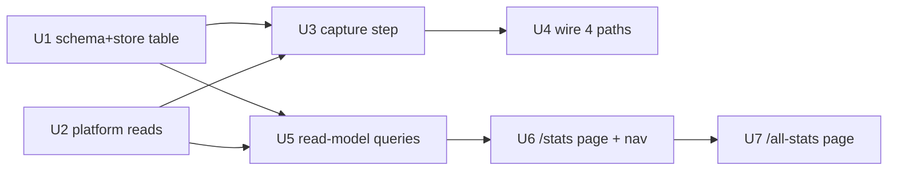

# feat: Session analytics & /stats + /all-stats pages

## Summary

Add a durable `session_analytics` table and a single capture-before-delete step that all four session-deletion
paths route through, so every deletion writes exactly one analytics record (full when the platform is readable,
flagged when it isn't) before the transcript and local row are destroyed. Add two server-rendered pages — `/stats`
(own sessions, navbar-linked) and `/all-stats` (all users, unlinked) — each split into a live section (one
lightweight platform read per session) and a deleted section (from the stored records), with totals and a
server-rendered inline-SVG/CSS time view. No new frontend dependencies or build step.

---

## Problem Frame

lik-ui captures no usage analytics, and mandatory auto-delete (default 7 days, daily prune) physically destroys
sessions from both the local DB and the platform — so the sessions people actually used are exactly the ones about
which nothing can later be learned. The only moment the data is both complete and about to be lost is right before
deletion. See origin for the full pain narrative (Sources & References).

---

## Requirements

- R1. `/stats` page — analytics for the logged-in viewer's own sessions only.
- R2. "Stats" link in top navigation, immediately after "Settings", pointing to `/stats`.
- R3. `/all-stats` page — analytics across all users; not navbar-linked, reached only by URL.
- R4. `/all-stats` requires a logged-in user but applies no further access restriction (proper access control deferred).
- R5. Every deletion writes exactly one durable analytics record before physical removal.
- R6. Capture is a single shared step all four deletion paths route through (manual delete, delete-all, prune job, self-heal).
- R7. Each record captures, when readable: token usage (input/output/cache-read/cache-creation separately), active + wall-clock time, user-message count, AI-message count, total tool-use count with per-tool and per-MCP-server breakdown, error count with error types, agent used, lifespan (created + deleted timestamps), and which deletion path.
- R8. On failed pre-delete read, still write the record from local fields, flagged with the incomplete reason.
- R9. Self-heal (platform session already gone) also writes a flagged record.
- R10. Each page splits into a live-sessions section and a deleted-sessions section.
- R11. Live numbers come from a lightweight on-demand per-session read (cumulative tokens, timing, status); the heavier per-message/per-tool/per-error tallies appear only for deleted sessions.
- R12. Each page shows both totals and a time-based view of sessions and tokens; on `/stats` the per-user dimension collapses to the single viewer.

**Origin actors:** A1 (session owner, `/stats`), A2 (operator, `/all-stats`), A3 (deletion trigger — the four paths).
**Origin flows:** F1 (capture-before-delete), F2 (view analytics).
**Origin acceptance examples:** AE1 (R5, R7 — full record, unflagged), AE2 (R8 — read fails → flagged local-only), AE3 (R9 — self-heal flagged), AE4 (R11 — live section, no per-tool tallies), AE5 (R1, R3 — own vs. all-user scoping).

---

## Scope Boundaries

- Real access control / admin roles on `/all-stats` — deferred; logged-in user is the only gate.
- Persisting live-session usage into the DB or periodic snapshotting — live numbers stay on-demand.
- Full per-event detail (message/tool/error tallies) for live sessions — deleted sessions only.
- Backfill of sessions deleted before this ships — unrecoverable; only post-ship deletions get records.
- Any change to deletion or retention behavior itself (cadence, mandatory auto-delete, the prune job).
- Export/CSV, dollar-cost pricing, and cross-workspace analytics.

---

## Context & Research

### Relevant Code and Patterns

- **Deletion primitives (the seam):** platform delete `AnthropicSessionsClient.delete_session` (`lik-ui/src/lik_ui/chat.py:129`); local row delete `Store.delete_session` (`lik-ui/src/lik_ui/db.py:215`). No combined helper exists — every path calls platform-delete then row-delete inline, in that order. That inline pair is where capture inserts.
- **The four deletion paths:** manual (`chat.py:421-440`), delete-all (`lik-ui/src/lik_ui/account.py:151-167`), prune job (`lik-ui/scripts/prune_sessions.py:36-64`), self-heal in the `except SessionNotFound` block of `chat_history` (`chat.py:532-536`, platform already gone → local-only).
- **Platform reads:** the `SessionsClient` Protocol (`chat.py:54`) + `AnthropicSessionsClient` are the single seam. `list_events` (`chat.py:291-327`) replays the transcript; `_normalize` (`chat.py:156-208`) already maps tool-use (`name`, `server`=`mcp_server_name`), errors (`error_type`), and per-request usage. `status` uses `beta.sessions.retrieve` (`chat.py:329-351`).
- **Session-list page pattern to mirror:** `sessions_page` (`chat.py:407-419`) + `templates/sessions.html` — `require_user`, query in Python, enrich rows (keep date math out of Jinja), render via shared `templates` (`app.py:28`). Cross-user query precedent: `Store.list_sessions_due` (`db.py:205`).
- **Route registration:** per-module `register_*_routes(app)` wired in `build_app` (`app.py:132-137`). Nav: `templates/base.html:28-33`. Auth: `require_user` (`app_auth.py:38`). Timestamps render client-side via `data-utc` + `tz.js` (`sessions.html:17`).

### Verified Platform Capability (resolves the R11 tension)

`beta.sessions.retrieve(session_id)` returns a `BetaManagedAgentsSession` carrying `.usage`
(`input_tokens`, `output_tokens`, `cache_read_input_tokens` — all flat `int | None`; plus `cache_creation`,
which is a **nested object** `{ephemeral_1h_input_tokens, ephemeral_5m_input_tokens}`, not a scalar — sum the two
for a single cache-creation total), `.stats` (`active_seconds`, `duration_seconds` = wall-clock — there is no
`startup_seconds` on this type), `.status`, `.created_at`, and `.agent` — **all in one call**. So the live-section
read is genuinely one lightweight `retrieve` per session (no event-stream walk), and capture can also source
token usage + timing from `retrieve` rather than summing `model_request_end` events. The
per-tool/per-message/per-error tallies still require `list_events`. [Certain — inspected the installed
`anthropic` SDK types; `cache_creation` nesting and absence of `startup_seconds` verified against
`beta_managed_agents_cache_creation_usage.py` / `beta_managed_agents_session_stats.py`.]

### Institutional Learnings

- `docs/solutions/architecture-patterns/sse-streaming-behind-idle-timeout-proxy-2026-07-27.md` — the only prior SDK learning. Carry-forward cautions: the events iterator is a **blocking synchronous generator** (a full `list_events` tally inside a request handler blocks; capture already runs in the request/script thread, acceptable here but keep the per-session live read to `retrieve` only, never `list_events`), and event streams have uneven/partial normalization — reconcile SDK field names against a real session (`scripts/smoke.py:103-135`) before trusting a computed tally.

### DB conventions

- Schema is a single idempotent `lik-ui/db/init.sql`; there is no `migrations/` directory — new tables/columns are appended as `CREATE TABLE IF NOT EXISTS` / `ALTER TABLE ... ADD COLUMN IF NOT EXISTS`. Prod (`lik-prod-db`) must be migrated as a **separate, explicit step** — `init.sql` re-run will NOT alter an existing table. Test guard: `tests/conftest.py` `_TABLES` (`:16`, a comma-joined string) must include any new table so it gets truncated between tests.

---

## Key Technical Decisions

- **New table `session_analytics`, keyed by `session_id` as PRIMARY KEY, written by UPSERT** (`ON CONFLICT (session_id) DO UPDATE`). Rationale: guarantees R5's "exactly one record" even if a path re-attempts deletion after a mid-delete failure (manual delete returns 502 and keeps the row; a later retry re-captures and overwrites rather than duplicating). No FK to `users`/`sessions` (those cascade-delete) so the record outlives both; store `user_id` **and** `user_email` denormalized so `/all-stats` can answer "by whom" after the user row is gone.
- **Per-tool/per-MCP-server breakdown and error-types stored as JSONB** columns (`tool_breakdown`, `error_types`). Rationale: store-agnostic, avoids a child table and a join, and the shapes are read-mostly aggregates rendered as-is.
- **Capture read is all-or-nothing.** The capture step attempts `retrieve` (usage/timing/status) + `list_events` (tallies) inside one try/except; any failure → write the record from local fields only, `capture_incomplete=true` with a reason (AE2). Rationale: partial-capture bookkeeping adds complexity for little value, and AE2 only requires "populated from local fields and flagged."
- **The local-only fallback builder must tolerate a thin session row.** `Store.list_sessions_due` (the prune path's source) currently selects only `session_id, user_id` (`db.py:205`), but the fallback record needs `agent_id` and `created_at` too. Fix at the source: extend `list_sessions_due` to also select `agent_id, created_at` (U1), **and** have the builder use `.get(...)` with `None` defaults so a missing key can never raise inside the fallback (which would abort a prune run — the exact opposite of "capture never blocks deletion"). Rationale: the fallback exists precisely for the read-failure case, so it must be the most defensive code in the feature.
- **Helpers and routes are split across two modules.** `analytics.py` holds pure helpers — `capture_session_analytics(store, sessions_client, session_row, deletion_path, platform_lost=False)`, the event tally, and the read-model builders — and imports **no** web/FastAPI/`app` symbols. `stats.py` holds the `/stats` + `/all-stats` route handlers and follows the existing lazy-import pattern (`from .app import templates` inside `register_stats_routes`, mirroring `chat.py:374`). Rationale: the standalone prune script imports `analytics.capture_session_analytics` and must **not** drag in the web stack; a module-level web import in `analytics.py` would also risk the documented `app.py`↔module import cycle. Self-heal passes `platform_lost=True` so it skips the read and writes a flagged record directly (R9).
- **Capture happens before the existing platform-delete + row-delete pair, not wrapped around it.** Rationale: the four paths have different failure/return semantics (502 pages, loop `continue`/`break`, HTTP 410) that must be preserved; a "delete both" wrapper would fight them. Capture is a prepended call, not a replacement.
- **Time view is server-rendered inline SVG/CSS bars** (Python buckets and sizes; template emits sized elements). Rationale: no JS bundler or chart lib exists; this adds zero dependencies and matches the server-rendered Jinja pattern. [User-confirmed during planning.]

---

## Open Questions

### Resolved During Planning

- Record shape & storage (origin R7 deferred): settled above — dedicated table, `session_id` PK + upsert, JSONB for breakdowns, denormalized `user_email`.
- Where the shared capture step lives (origin R6 deferred): `lik-ui/src/lik_ui/analytics.py`, prepended call at each of the four sites.
- Live-number source & lightweight read (origin dependency): `beta.sessions.retrieve` — verified to carry usage + stats + status in one call.
- Visualization medium (origin R12 deferred): server-rendered inline SVG/CSS.

### Deferred to Implementation

- Exact time bucketing (daily vs. weekly, fixed vs. adaptive window) and the totals-table column set — the origin flagged only that both totals and an over-time view must exist. To avoid an ordering trap: U5 emits the **finest** bucket (daily `date_trunc`); U6/U7 collapse to a coarser view at render time if desired. So U5 does not block on the display-granularity choice.
- Exact `_normalize` field reconciliation for tally edge cases (e.g. thinking events, compaction) — verify against a live session per the SSE learning before finalizing counts.

---

## Output Structure

    lik-ui/src/lik_ui/
      analytics.py                 # NEW — pure helpers: capture step + event-tally + read-model. NO web imports
      stats.py                     # NEW — FastAPI routes (/stats, /all-stats) via register_stats_routes(app)
      templates/
        stats.html                 # NEW — shared stats layout (live + deleted sections, totals, time view)
      static/
        stats.css                  # NEW (or appended to app.css) — bar/meter styles
    lik-ui/tests/
      test_analytics.py            # NEW — capture + tally + read-model unit tests
      test_stats_pages.py          # NEW — /stats and /all-stats route tests

(Existing files modified: `db/init.sql`, `db.py`, `chat.py`, `account.py`, `scripts/prune_sessions.py`,
`app.py`, `templates/base.html`, `tests/conftest.py`.)

---

## High-Level Technical Design

> *This illustrates the intended approach and is directional guidance for review, not implementation specification.
> The implementing agent should treat it as context, not code to reproduce.*

Capture-before-delete, unified across the four paths:

```
each deletion path
        │
        ▼
capture_session_analytics(store, client, session_row, deletion_path, platform_lost)
        │
        ├─ platform_lost? ──yes──▶ build record from local fields, incomplete=true, reason="lost before capture"
        │                                            │
        └─ no ─▶ try: retrieve() → usage/timing/status                │
                     list_events() → message/tool/error tallies       │
                 except: record from local fields, incomplete=true ───┤
                     else: full record, incomplete=false              │
                                                                      ▼
                                          store.write_session_analytics(record)   # UPSERT on session_id
        │
        ▼
existing platform-delete + row-delete (unchanged per-path semantics)
```

Unit dependency graph:



---

## Implementation Units

- U1. **`session_analytics` table + store write/read scaffolding**

**Goal:** Persist the analytics record durably, keyed for exactly-once upsert, surviving user/session deletion.

**Requirements:** R5, R7

**Dependencies:** None

**Files:**
- Modify: `lik-ui/db/init.sql` (append `CREATE TABLE IF NOT EXISTS session_analytics ...`)
- Modify: `lik-ui/src/lik_ui/db.py` (add `write_session_analytics` upsert; extend `list_sessions_due` at `:205` to also select `agent_id, created_at` so the prune fallback has them)
- Modify: `lik-ui/tests/conftest.py` (append `session_analytics` to `_TABLES` — note it is a comma-joined string, not a Python list, interpolated into `TRUNCATE`; the table has no FK so it must be listed explicitly)
- Test: `lik-ui/tests/test_db.py`

**Approach:**
- Columns: `session_id text PRIMARY KEY`, `user_id bigint NOT NULL`, `user_email text`, `agent_id text`,
  `deletion_path text NOT NULL`, `created_at timestamptz`, `deleted_at timestamptz NOT NULL DEFAULT now()`,
  `capture_incomplete boolean NOT NULL DEFAULT false`, `capture_reason text`,
  token columns `input_tokens/output_tokens/cache_read_tokens/cache_creation_tokens bigint`
  (`cache_creation_tokens` = sum of the SDK's nested `ephemeral_1h_input_tokens + ephemeral_5m_input_tokens`, not a direct field),
  timing `active_seconds/wall_clock_seconds numeric`, counts
  `user_message_count/ai_message_count/tool_use_count/error_count integer`,
  `tool_breakdown jsonb`, `error_types jsonb`. Nullable metric columns so a flagged local-only record is valid.
- No FK (record must outlive `users`/`sessions` cascade). Index on `(user_id, deleted_at)` for `/stats`, and on `deleted_at` for `/all-stats` time bucketing.
- `write_session_analytics` is an `INSERT ... ON CONFLICT (session_id) DO UPDATE SET ...` so a re-capture overwrites.

**Patterns to follow:** existing `CREATE TABLE IF NOT EXISTS` + `ALTER ... IF NOT EXISTS` blocks and index style in `init.sql`; `Store` method style in `db.py` (`delete_session`, `list_sessions_due`).

**Test scenarios:**
- Covers R5. Happy path: writing a record then writing again with the same `session_id` results in exactly one row (upsert overwrites, no duplicate).
- Happy path: a fully-populated record round-trips all columns including `tool_breakdown`/`error_types` JSONB.
- Edge case: a record with all metric columns null but `capture_incomplete=true` and a `capture_reason` persists and reads back.
- Edge case: record persists (is still queryable) after the referenced `users` row is deleted — proves no cascade.

**Verification:** `session_analytics` exists after `init.sql`; `conftest` truncates it; upsert yields one row per `session_id`.

---

- U2. **Platform read helpers: lightweight usage snapshot + event tally**

**Goal:** Provide one lightweight per-session read (usage/timing/status) and one full event-tally read, both behind the existing client seam with stub/fake parity.

**Requirements:** R7, R11

**Dependencies:** None

**Files:**
- Modify: `lik-ui/src/lik_ui/chat.py` (add `usage_snapshot(session_id)` to `SessionsClient` Protocol + `AnthropicSessionsClient`; reuse `_normalize`/`list_events` for tally, or add a `tally_session(session_id)` helper)
- Create/Modify: tally logic may live in `lik-ui/src/lik_ui/analytics.py` (U3) consuming `list_events`; keep the raw SDK access in `chat.py`
- Test: `lik-ui/tests/test_chat.py`

**Approach:**
- `usage_snapshot(session_id)` → `beta.sessions.retrieve`, returning a plain dict `{input, output, cache_read, cache_creation, active_seconds, wall_clock_seconds, status, created_at, agent}`. Tolerate `None` sub-fields (SDK marks them optional). **`cache_creation` must be computed** as `(ephemeral_1h_input_tokens or 0) + (ephemeral_5m_input_tokens or 0)` from the nested object (guard the object itself being `None`); `wall_clock_seconds` maps to `stats.duration_seconds`. Raise `SessionNotFound` on `NotFoundError`, mirroring `status`.
- Event tally: iterate `list_events` once, counting `user.message`, `agent.message`, normalized `tool_use` (bucketed by `name` and `server`), and `error` (bucketed by `error_type`); return counts + the two breakdown dicts. Reuse `_normalize` so tool/server/error identity matches the chat view exactly.
- Extend the stub/fake path: `build_sessions_client` returns None in stub, so pages must guard `client is None` (mirror existing manual-delete guard). Provide fake support for tests.

**Patterns to follow:** `status`/`list_events` in `chat.py` (NotFound→`SessionNotFound`, `retrieve` usage); `_normalize` mappings at `chat.py:156-208`; SDK field reconciliation via `scripts/smoke.py`.

**Test scenarios:**
- Covers R11. Happy path: `usage_snapshot` returns cumulative tokens (incl. cache-read/creation), active + wall-clock seconds, and status from a faked `retrieve`.
- Happy path: event tally over a fixture stream yields correct user/AI message counts, `tool_use_count` with per-tool and per-server breakdown, and `error_count` with error-type breakdown.
- Edge case: `retrieve` with null `usage`/`stats` sub-fields → snapshot returns zeros/None without raising.
- Error path: `retrieve`/`list_events` on a missing session raises `SessionNotFound`.

**Verification:** both reads work against the fake client; a live-session snapshot needs only one `retrieve` (no `list_events`).

---

- U3. **Shared capture-before-delete step**

**Goal:** One function that produces exactly one analytics record — full when readable, flagged when not — for any deletion path.

**Requirements:** R5, R6, R7, R8, R9

**Dependencies:** U1, U2

**Files:**
- Create: `lik-ui/src/lik_ui/analytics.py` (`capture_session_analytics(store, sessions_client, session_row, deletion_path, platform_lost=False)`)
- Test: `lik-ui/tests/test_analytics.py`

**Approach:**
- `deletion_path` is a constrained label: `"manual" | "delete_all" | "prune" | "self_heal"`.
- If `platform_lost` or `sessions_client is None` (stub) → build the record from `session_row` local fields (`session_id`, `user_id`, `agent_id`, `created_at`, `user_email` looked up if needed), `capture_incomplete=true`, reason (`"lost before capture"` for self-heal, `"platform client unavailable"` for stub).
- Else attempt `usage_snapshot` + event tally in one try/except. Success → full record, `capture_incomplete=false`. Any exception → local-only record, `capture_incomplete=true`, `capture_reason=str(exc)`.
- Always call `store.write_session_analytics` exactly once. Never raise to the caller — capture must not block deletion (F1 outcome).
- Record `deleted_at=now()`, `created_at` from the session row (authoritative lifespan start).

**Execution note:** Implement test-first — the four-path × read-outcome matrix is the core correctness surface and is cheap to pin with a `FakePlatform`.

**Patterns to follow:** `tests/test_prune_sessions.py` `FakePlatform` (records calls, `raise_on` ids) as the base harness — but it currently implements only `delete_session`, so **extend it** with `usage_snapshot` and `list_events` (serving fixture usage + event streams, with per-id raise support) to exercise the capture read surface. It is not a drop-in reuse.

**Test scenarios:**
- Covers AE1 / R5, R7. Happy path: reachable platform, session with turns → unflagged record with tokens, timing, message counts, tool + server breakdown, error detail, agent, deletion path.
- Covers AE2 / R8. Error path: `usage_snapshot` raises → record still written from local fields, flagged, with a reason; function returns without raising.
- Covers AE3 / R9. Edge case: `platform_lost=True` → flagged "lost before capture" record, no platform read attempted.
- Edge case: stub client (`None`) → flagged record, no crash.
- Covers R8. Edge case: read fails on a **thin prune-style row** (only `session_id`/`user_id` present, no `agent_id`/`created_at`) → fallback writes a record with those fields null and does not raise (guards the prune-abort regression).
- Covers R5. Idempotency: calling capture twice for the same session yields one row (relies on U1 upsert).
- Integration: capture never raises even when both `retrieve` and `list_events` raise.

**Verification:** exactly one record per session_id across all outcomes; deletion is never blocked by capture.

---

- U4. **Route all four deletion paths through capture**

**Goal:** Prepend `capture_session_analytics` to each deletion path with the correct `deletion_path` label and self-heal handling, preserving each path's existing failure/return semantics.

**Requirements:** R5, R6, R8, R9

**Dependencies:** U3

**Files:**
- Modify: `lik-ui/src/lik_ui/chat.py` (manual delete `:421-440`; self-heal `:532-536`)
- Modify: `lik-ui/src/lik_ui/account.py` (delete-all `:151-167`)
- Modify: `lik-ui/scripts/prune_sessions.py` (prune `:36-64`)
- Test: `lik-ui/tests/test_chat.py`, `lik-ui/tests/test_account.py`, `lik-ui/tests/test_prune_sessions.py`

**Approach:**
- Manual (`"manual"`), delete-all (`"delete_all"` per iteration), prune (`"prune"` per due session): call capture immediately **before** the existing platform-delete + row-delete pair. Existing 502/`continue`/`break` semantics unchanged.
- Self-heal: inside the `except SessionNotFound` block, call capture with `platform_lost=True, deletion_path="self_heal"` **before** the existing `store.delete_session`; still return HTTP 410. Note: `chat_history` gates on `get_accessible_session`, so a non-owner viewer of a shared session can reach this block where the owner-scoped `store.delete_session(..., user["id"])` no-ops — capture still writes a `self_heal` record while the local row survives. The `session_id` PK + upsert keeps this eventually-consistent (the owner's later delete overwrites), so exactly-once holds; acceptable.
- Prune script must import `analytics.capture_session_analytics` and pass its constructed store + client + the due-session row.

**Patterns to follow:** the existing inline delete order at each site; prune's two-leg failure policy (`continue` on platform failure, `break` on row-delete failure) stays intact — capture runs before both legs.

**Test scenarios:**
- Covers R6 / AE1. Integration: deleting via each of the four paths writes a record with the matching `deletion_path`, before the row is gone.
- Covers AE3 / R9. Integration: self-heal (`chat_history` on a platform-missing session) writes a flagged `self_heal` record and still returns 410.
- Error path: manual delete where platform-delete fails after capture → 502 preserved, row retained, and the (flagged-or-full) record already written.
- Integration: prune run over multiple due sessions writes one record each; a platform failure on one still records it and `continue`s.
- Edge case: delete-all over N sessions writes N records with `deletion_path="delete_all"`.

**Verification:** post-deletion, every path leaves exactly one record; no path regresses its existing HTTP/loop behavior.

---

- U5. **Read-model queries for the pages**

**Goal:** Store/read helpers that feed both pages: live-session lists (own + all users) and deleted-session aggregates + time buckets (own + all users).

**Requirements:** R1, R3, R10, R11, R12

**Dependencies:** U1, U2

**Files:**
- Modify: `lik-ui/src/lik_ui/db.py` (deleted-session aggregate + per-bucket queries, own-scoped and cross-user; reuse `list_sessions`/`list_sessions_due` for the live lists)
- Modify/Create: `lik-ui/src/lik_ui/analytics.py` (assemble live-section rows by calling `usage_snapshot` per live session; build totals + time-series view models)
- Test: `lik-ui/tests/test_analytics.py`, `lik-ui/tests/test_db.py`

**Approach:**
- Live section: list the viewer's undeleted sessions (own) or all (`/all-stats`), call `usage_snapshot` per session, tolerate per-session read failure (show the session with a "usage unavailable" marker rather than failing the page). Skip live reads entirely when the client is stub/None.
- Deleted section: SQL aggregates over `session_analytics` — totals (session count, summed tokens split by kind, tool/error counts) and time buckets (group by `date_trunc` over `deleted_at`), own-scoped (`WHERE user_id=%s`) or cross-user. `/all-stats` also groups the time view per user; `/stats` collapses to the single viewer.
- Keep all date math in Python/SQL, not Jinja (existing convention).

**Patterns to follow:** `list_sessions` (own-scoped) and `list_sessions_due` (cross-user) in `db.py`; row-enrichment-in-Python pattern from `sessions_page`.

**Test scenarios:**
- Covers R11 / AE4. Happy path: live-section builder returns per-session cumulative tokens/timing/status and no per-tool/per-message tallies.
- Edge case: a live session whose `usage_snapshot` raises is still listed, marked unavailable; the page-level build does not fail.
- Covers R12. Happy path: deleted-section aggregate returns correct totals and time buckets from seeded `session_analytics` rows.
- Covers AE5 / R1, R3. Edge case: own-scoped query returns only the viewer's records; cross-user returns all.
- Edge case: empty state (no live sessions, no records) returns zeroed totals and empty buckets, not an error.

**Verification:** aggregates match seeded data; own vs. all-user scoping is correct; live builder degrades per-session on read failure.

---

- U6. **`/stats` page, nav link, and shared stats template**

**Goal:** Ship `/stats` (own sessions) with live + deleted sections, totals, and the server-rendered time view, plus the navbar link — building the shared template both pages use.

**Requirements:** R1, R2, R10, R11, R12

**Dependencies:** U5

**Files:**
- Create: `lik-ui/src/lik_ui/stats.py` (`register_stats_routes(app)`; lazy `from .app import templates`)
- Create: `lik-ui/src/lik_ui/templates/stats.html`
- Create/Modify: `lik-ui/src/lik_ui/static/stats.css` (or append to `app.css`)
- Modify: `lik-ui/src/lik_ui/app.py` (wire `register_stats_routes` in `build_app`)
- Modify: `lik-ui/src/lik_ui/templates/base.html` (add "Stats" link after "Settings", `:31`)
- Test: `lik-ui/tests/test_stats_pages.py`

**Approach:**
- Route `GET /stats`: `require_user`, build own-scoped view models (U5), render `stats.html`.
- Template: two sections (live, deleted). Live shows per-session cumulative tokens/timing/status. Deleted shows totals + inline-SVG/CSS bar time view + a per-tool/per-error summary. Timestamps use `data-utc` + `tz.js`.
- Time view: Python emits pre-sized bar elements (width/height from bucket value ÷ max); template renders them. No client JS beyond existing `tz.js`.

**Patterns to follow:** `sessions_page` route + `sessions.html`; `register_*_routes` wiring; nav markup in `base.html:28-33`; `data-utc` timestamp convention.

**Test scenarios:**
- Covers AE4 / R11. Route test: `/stats` for a logged-in user renders the live section with cumulative numbers and no per-tool tallies for live sessions.
- Covers R1 / AE5. Route test: `/stats` shows only the viewer's own deleted records, not another user's.
- Happy path: deleted section renders totals and the time bars from seeded records.
- Error path: unauthenticated `GET /stats` redirects to `/login` (existing `NotAuthenticated` behavior).
- Edge case: user with no sessions and no records gets an empty-but-valid page.
- Integration: the "Stats" link appears in nav immediately after "Settings" (R2).

**Verification:** `/stats` renders both sections for the viewer's own data; nav link present and correctly placed.

---

- U7. **`/all-stats` cross-user page**

**Goal:** Ship `/all-stats` reusing the shared template/rendering, spanning all users, unlinked, gated only by login.

**Requirements:** R3, R4, R12

**Dependencies:** U6

**Files:**
- Modify: `lik-ui/src/lik_ui/stats.py` (add `GET /all-stats`)
- Modify: `lik-ui/src/lik_ui/templates/stats.html` (parameterize scope label + per-user dimension in the time view)
- Test: `lik-ui/tests/test_stats_pages.py`

**Approach:**
- Route `GET /all-stats`: `require_user` only (no further gate — R4), build cross-user view models (U5), render the shared template with the per-user dimension present. Not added to nav (R3).
- Reuse U6's template; the only deltas are cross-user data and the per-user breakdown in the time view.

**Patterns to follow:** U6 route/template; cross-user query from U5.

**Test scenarios:**
- Covers AE5 / R3. Route test: `/all-stats` shows sessions/records from multiple users.
- Covers R4. Route test: any logged-in user can load `/all-stats`; unauthenticated redirects to `/login`.
- Covers R3. Integration: `/all-stats` is absent from the nav (only reachable by URL).
- Covers R12. Happy path: the time view carries the per-user dimension on `/all-stats` and collapses on `/stats`.

**Verification:** `/all-stats` spans all users, needs only login, and is not linked in nav.

---

## System-Wide Impact

- **Interaction graph:** capture is prepended at four call sites (`chat.py` ×2, `account.py`, `scripts/prune_sessions.py`); the prune script now imports `analytics.py`. New route module wired in `build_app`.
- **Error propagation:** capture never raises to its callers — a capture failure yields a flagged record, never a blocked deletion. Per-session live-read failures degrade to a marked row, never a failed page.
- **State lifecycle risks:** exactly-once is enforced by the `session_id` PK + upsert (guards the manual-delete-502-then-retry case). The record intentionally outlives `users`/`sessions` (no FK cascade).
- **API surface parity:** all four deletion paths must route through the one capture step — a fifth deletion path added later must too (call it out in review). The `SessionsClient` Protocol gains `usage_snapshot`; the stub (`None`) path must be guarded everywhere it's read.
- **Integration coverage:** the four-path × read-outcome matrix (U3/U4) is the correctness core; unit-level mocks alone won't prove capture-before-delete ordering — assert the record exists before the row is gone.
- **Unchanged invariants:** deletion order (platform-delete then row-delete), the 502/`continue`/`break`/410 semantics of each path, and retention cadence are unchanged. This work only prepends a capture call and adds read-only pages.

---

## Risks & Dependencies

| Risk | Mitigation |
|------|------------|
| A future fifth deletion path silently skips capture | Single shared function + a review note in System-Wide Impact; consider a test that asserts every path that calls `Store.delete_session` also captures. |
| `list_events` blocking iterator stalls a request during capture | Capture already runs synchronously in the request/script thread and the transcript is bounded; keep the live per-session read to `retrieve` only (never `list_events`). Per the SSE learning. |
| SDK usage/stats sub-fields null or renamed | `usage_snapshot` tolerates `None`; reconcile field names against a live session via `scripts/smoke.py` before finalizing (deferred question). |
| `/all-stats` live section slow with many sessions (one `retrieve` each) | Accepted for this version per origin; caching deferred. `/stats` (own sessions) is the latency-sensitive path and stays small. |
| Prod DB not migrated when code merges | `init.sql` won't alter an existing DB; the `CREATE TABLE IF NOT EXISTS session_analytics` must be applied to `lik-prod-db` as a separate step (offer to help post-merge). |

---

## Documentation / Operational Notes

- **Performance & caching:** deleted-section numbers are indexed SQL aggregates (cheap); the only per-view cost is one `retrieve` per live session, so add caching later — a short-TTL memo at the `usage_snapshot` seam (U2) — only if `/all-stats` gets slow.
- **Prod migration (required, separate from merge):** apply `CREATE TABLE IF NOT EXISTS session_analytics (...)` + its indexes to `lik-prod-db`. Non-destructive, additive. Offer to help run it after the PR merges.
- **FAQ:** per project convention, ask whether `lik-ui/src/lik_ui/faq.md` should mention the new `/stats` page after the PR is up.

---

## Sources & References

- **Origin document:** [docs/brainstorms/2026-07-29-session-analytics-stats-page-requirements.md](docs/brainstorms/2026-07-29-session-analytics-stats-page-requirements.md)
- Deletion seam: `lik-ui/src/lik_ui/chat.py:129`, `lik-ui/src/lik_ui/db.py:215`
- Four paths: `chat.py:421-440`, `account.py:151-167`, `scripts/prune_sessions.py:36-64`, `chat.py:532-536`
- Platform reads: `chat.py:54` (Protocol), `chat.py:156-208` (`_normalize`), `chat.py:291-351` (`list_events`/`status`)
- Page pattern: `chat.py:407-419`, `templates/sessions.html`, `app.py:132-137`, `templates/base.html:28-33`
- Learning: `docs/solutions/architecture-patterns/sse-streaming-behind-idle-timeout-proxy-2026-07-27.md`
