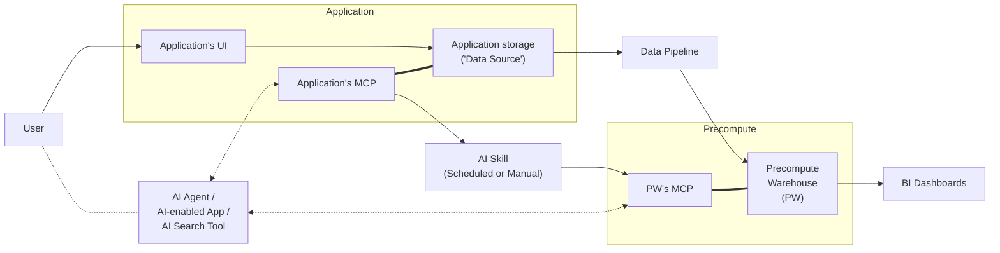
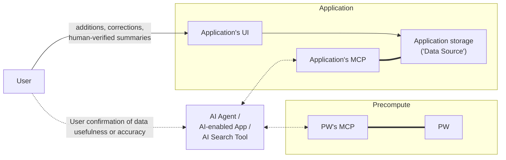

As new data sources or apps become available, easily include it via MCP. Getting the data into the data warehouse: once \- easy, straightforward; periodically \- add it to the data pipeline and update DB schema and semantic model

# **Short Architecture Brief: Institutional Knowledge for AI Enablement**

## **1. Purpose**

This architecture describes a simple, versatile approach for making institutional knowledge available to AI agents, AI-enabled applications, search platforms, and people across the organization.

The core goal is **AI-enablement through data democracy**: make it easier for authorized users and tools to find relevant, trusted, and up-to-date knowledge without requiring every AI agent or application to perform expensive, repetitive, and error-prone searches across every source system.

The architecture keeps institutional knowledge in the data sources where it belongs, while using a lightweight **Precompute Warehouse**, or **PW**, to make common discovery, prioritization, and retrieval tasks faster and more reliable.

A secondary goal is **operational BI and reporting**: the same Precompute Warehouse also serves deterministic dashboards and structured reporting outputs. This is an explicit, stated goal to capture the deterministic data pipeline (DSs → Pipeline → PW → BI Dashboards) that this architecture is inspired by.

---

## **2. Core Concepts**

### **Data Sources, or DSs**

Data Sources, or **DSs**, are the systems where institutional knowledge is created, maintained, corrected, summarized, governed, and accessed.

Examples include:

* Google Drive
* Confluence
* Jira
* GitHub
* Slack
* Gmail
* Google Calendar
* Google Meet recordings
* Zoom recordings
* Workday
* Greenhouse
* Unanet
* Salesforce
* Figma

In this model, **new durable knowledge should be added to a DS**, such as a Confluence page, Google Doc, Jira ticket, or other appropriate source system.

Similarly, **data corrections should happen in a DS**, not in the PW.

Human-verified summaries should also be added to a DS. For example, a project summary might live in Confluence, a Google Doc, or a project-specific source of truth.

This keeps the architecture simple: DSs remain the places where people create, edit, correct, summarize, and govern institutional knowledge.

### **Precompute Warehouse, or PW**

The **Precompute Warehouse**, or **PW**, is a computed layer derived from DSs.

The PW contains computed data that helps common queries quickly find relevant, prioritized, trusted, and up-to-date information in DSs.

The PW may include:

* Aggregations across DSs.
* Indexes over DS content.
* Categorization metadata.
* Prioritized pointers to relevant DS records.
* Freshness and trust metadata.
* Obsolescence indicators.
* Data confirmation signals.
* Search optimization metadata.
* Retrieval hints for common question patterns.
* Access-control metadata propagated from DSs.

The PW helps AI agents and applications avoid spending unnecessary time, tokens, and effort searching across many systems, following dead ends, or repeatedly recomputing common retrieval signals.

Most PW content is **recomputable**: indexes, aggregations, categorization, retrieval hints, and propagated access-control metadata can all be rebuilt from DSs if the PW is deleted.

However, **data confirmation signals** (see Section 8) originate in the PW from user feedback and do not exist in any DS. They are **durable PW-origin data**, not recomputable output, and therefore require their own backup and retention. The "rebuild from DSs" property applies only to the recomputable subset; durable PW-origin data must be preserved independently.

---

## **3. Design Principles**

### **Keep DSs authoritative**

DSs remain the source of truth. Durable additions, corrections, and human-verified summaries happen in DSs, not in the PW.

### **Keep the PW computed**

The PW stores computed outputs, indexes, aggregations, categorization metadata, trust signals, freshness indicators, and confirmation signals.

It should not become a manually maintained knowledge base.

### **Keep access control simple**

Role-based access should use existing Google access control wherever possible.

Access should be implemented by:

1. Adding users to Google Groups.
2. Attaching those Google Groups to particular data in DSs.
3. Propagating the relevant access-control metadata from DSs into the PW.
4. Enforcing those permissions when the PW is queried.

**Per-DS ACL mapping is required.** Most DSs do not natively express permissions as Google Groups — Slack uses channel membership, Jira/Confluence use Atlassian roles and permission schemes, Salesforce uses profiles and sharing rules, and Workday/Greenhouse/Unanet use their own role models. For each DS, document whether native Google-Group attachment is possible and, where it is not, define how that system's native ACLs are normalized into the propagated access-control metadata. For the majority of DSs the admin mapping process below is the **primary** mechanism, not an exception, and should be scoped as such.

When it is not possible to attach a Google Group directly to particular data in a DS, an admin mapping process applies Google Group access controls when defined criteria are met. This process must have a **named owner**, must **default to deny** for any record that matches no criterion (records are never ingested as world-readable by default), and must define **conflict resolution** when multiple criteria apply (most-restrictive wins). Example criteria include:

* Data comes from a particular DS.
* Data has a particular tag or label.
* Data belongs to a particular category.
* Data is associated with a particular project, client, team, or business function.
* Data matches a governance rule requiring restricted access.

This avoids creating a separate RBAC system while still allowing access controls to be applied consistently across heterogeneous DSs.

### **Keep identity simple**

#### Read access

Identity is established by **Google SSO**. An email address is an identifier, not an authenticator — it must never be accepted as a self-asserted parameter at a trust boundary. For read-only access, MCP services require a **verified Google OIDC/OAuth token** (audience-validated); the verified email *claim* from that token is what determines which DS and PW data the user can access. The authenticated identity must be carried across each agent → MCP → PW hop (e.g., token passthrough or an on-behalf-of flow) so the PW never trusts an unverified email string. This requirement applies equally to invocations from AI agents and from automation tools such as Zapier.

#### Write access to DSs

For write access to DSs, the user's verified SSO identity is likewise used. Users make additions, corrections, and human-verified summaries directly in DSs using their own identity and the DS's normal permissions.

#### Write access to PW

Only explicitly allowed applications can write directly to the PW. A **service account email address** is needed for applications that write data to the PW. An example application is a data-confirmation app. This mechanism reminds users that they shouldn't modify PW directly.

### **Optimize for AI-enablement**

DSs and the PW should be accessible through MCP services. MCP services are the main method AI tools use to query institutional data.

This allows AI agents and AI-enabled applications to query DSs and the PW in a consistent, permission-aware way. The goal is to make it easy for AI tools to discover useful knowledge quickly, with enough context to understand which DS records are relevant, trusted, current, and authorized.

### **Enable data democracy**

Authorized users should be able to use AI-enabled tools to access institutional knowledge without needing to know where every artifact lives or how each DS is structured.

---

## **4. Data Flows**

- DSs → Deterministic Data Pipeline → PW → BI Dashboards
- DSs → AI Skill → PW
- MCP Services ↔ DSs
- MCP Services ↔ PW
- AI tools query through MCP Services
- Confirmations go to PW
- Durable updates go to DSs

At a high level, the architecture has four main flows.

### **4.1 Knowledge Creation and Governance**

* Institutional knowledge is created, corrected, and summarized in DSs.
  * New durable knowledge is written to a DS.
  * Corrections are made in a DS.
  * Human-verified summaries are stored in a DS.
* Access control is managed using Google SSO and Google Groups.
  * Google Groups are attached to data in DSs where possible.
  * When direct attachment is not possible, an admin process applies group-based access rules using criteria such as DS, tag, label, category, project, or business function.

### **4.2 PW Population and Refresh**

* Access-control metadata is propagated from DSs into the PW.
  * The PW uses this metadata to enforce permissions when queried.
* Deterministic PW artifacts are updated by regular data pipelines.
  * This includes dashboard-related artifacts, structured aggregations, and reporting outputs.
  * These updates do not require AI involvement.
* AI-assisted PW content is updated by scheduled or manually-run AI skills.
  * The skill may compute indexes, categories, retrieval hints, freshness signals, trust metadata, and confirmation signals.
  * The skill performs staleness checks on referenced DS content.
  * If source data has changed, moved, been deleted, or had access controls changed, the related PW content is updated, marked stale, or removed.
  * The skill may be run directly by a user or AI agent, or exposed through an MCP service for automated invocation.

### **4.3 Query and Retrieval**

* AI agents, search tools, and AI-enabled applications query DSs and the PW through MCP services.
  * MCP services are the primary query path for AI tools.
  * Read-only access requires a verified Google SSO (OIDC/OAuth) identity token; the verified email claim is used to authorize the request.
  * Query results are filtered using DS permissions and PW access-control metadata.
  * **Enforcement tier:** the PW MCP service resolves the caller's group memberships and applies them as authorized query predicates — or uses BigQuery authorized views / row-access policies keyed to the SSO identity — so that restricted rows are never returned to the AI tool before access-control filtering. Propagated group metadata is indexed to support this filtering.
* The PW helps tools identify the best DS records to retrieve.
  * It provides computed aggregations, indexes, categories, source pointers, freshness metadata, trust signals, and retrieval hints.
  * This reduces latency, token usage, duplicate searching, and dead ends.

### **4.4 User Feedback and Source Updates**

* Users may confirm whether retrieved data, rankings, or computed signals are useful or accurate.
  * These confirmation signals are stored in the PW.
  * Confirmations may improve future ranking, trust, and retrieval behavior.
  * Because confirmations influence ranking and trust for all users, each confirmation write must carry the **verified SSO identity** of the confirming user (the same token mechanism used for reads), be **rate-limited**, and record **provenance** so confirmations can be attributed and, if needed, discounted or revoked. This prevents anonymous poisoning of the retrieval layer.
* Durable updates happen in DSs.
  * New data is added to a DS.
  * Corrections are made in a DS.
  * Human-verified summaries are written to a DS.
* Applications that write data to the PW use a service account email address.
  * This is only needed for PW writes.
  * It is not needed for read-only access or for users writing directly to DSs.

---

## **5. PW Update Mechanisms**

The PW is updated through two complementary mechanisms.

### **Deterministic Data Pipelines**

For deterministic artifacts, such as dashboards and structured reporting outputs, a regular data pipeline updates the PW without AI involvement.

This pipeline is appropriate when the transformation logic is known, repeatable, and does not require AI interpretation.

Examples include:

* Dashboard source tables.
* Structured aggregations.
* Operational metrics.
* Standard reporting indexes.
* Scheduled extracts from DSs.

### **AI Skills**

For AI-assisted or interpretation-heavy computed content, the PW is updated by a scheduled or manually-run AI skill.

The skill is responsible for:

* Reading appropriate DS content.
* Respecting DS access-control metadata.
* Computing indexes and aggregations.
* Categorizing DS content.
* Detecting freshness and obsolescence signals.
* Performing staleness checks on referenced source data.
* Determining whether PW content needs updating.
* Updating trust and confirmation metadata.
* Propagating access-control metadata into the PW.
* Rebuilding PW content when needed.

When rebuilding or refreshing PW content, the skill must check the staleness of referenced source data. If the DS content referenced by the PW has changed, been deleted, moved, had access controls changed, or otherwise become stale, the relevant PW content should be updated, marked stale, or removed.

**Skill identity and scope.** The skill is the most privileged actor in the system: it reads broadly across DSs and writes to the PW. Its identity and read scope must be defined explicitly and per DS, following least privilege — it should hold only the read access required for the DSs it processes. The skill must capture each item's **source access-control metadata at read time** so that every derived PW artifact is stamped with the correct ACL; failure to do so silently widens access. All skill reads and PW writes must be **audit-logged** for security.

---

## **6. Application and Agent Access**

AI agents and AI-enabled applications may query institutional data to answer questions, generate content, retrieve context, or help users navigate organizational knowledge.

The primary query path is through MCP services connected to DSs and the PW.

Examples include:

### **Simple AI Agent**

A locally run Claude Cowork-style agent with connectors or MCP services for approved DSs and the PW. It can answer user questions by querying DSs and using the PW to quickly identify likely relevant records.

### **Commercial AI-Enabled Apps**

Examples include:

* Glean
* GoSearch
* SearchUnify

These products may provide enterprise search, AI answers, knowledge discovery, and content generation over connected DSs and the PW.

### **Self-Hosted Search and AI Platforms**

Examples include:

* Onyx Community Edition
* PipesHub
* SWIRL

These platforms may provide an internal search and retrieval layer over DSs, optionally using the PW to improve relevance, trust, freshness, and performance.

### **Third-Party Integration Trust Boundary**

Commercial and self-hosted tools are a distinct trust zone, not implicit insiders. Because the PW aggregates institutional knowledge across many DSs, connecting an external tool to it without controls creates a path for bulk re-export of data that was individually restricted at the source. For each external consumer, define:

* **Credential scope** — how the tool authenticates and the least-privilege slice of DSs/PW it may read.
* **Data minimization** — which portion of the PW the tool may access, rather than the whole warehouse.
* **Retention and training constraints** — what the tool may store, index, or train on outside the organization's infrastructure.
* **Breach containment** — how a compromise of the tool is detected and bounded.

Note that external tools typically query under their own service credentials and proxy the end-user's identity; the integration must ensure the tool faithfully represents the requesting user so PW enforcement is not bypassed.

---

## **7. Access Control**

The preferred access-control model is Google SSO plus Google Groups.

For DSs:

* Sensitive data remains protected by the source application.
* Role-based access is represented through Google Groups where possible.
* Google Groups are attached to particular data in DSs when supported.
* If direct attachment is not possible, an admin process applies group-based access controls using defined criteria.
* The DS or connector enforces native permissions.
* Users only receive data they are authorized to access.

For the PW:

* Access-control metadata is propagated from DSs into the PW.
* The PW enforces access based on the propagated metadata.
* Sensitive computed data should be restricted using Google Groups.
* Google SSO should be used to identify the requesting user.
* A service account email address is only required for applications that write data to the PW.

**Access-control freshness contract.** Propagated metadata is a cache, and a stale cache grants access after a DS has revoked it (offboarding, re-share, restriction). To avoid this, **permission-metadata refresh is decoupled from content-staleness refresh** — they have opposite risk profiles (stale content is merely outdated; a stale grant leaks data). For sensitive categories the PW either re-validates the caller against the live DS / Google Group permission at query time, or enforces a stated **maximum propagation lag** with a **fail-closed default** (newly restricted content is denied until reconfirmed).

**Access control for computed and aggregated artifacts.** A cross-DS aggregation or index derived from multiple records has no single source ACL, and its sensitivity can exceed any individual input (the mosaic effect). Such artifacts inherit the **intersection of all contributing sources' access groups (most-restrictive wins)** and are **restricted by default** until explicitly cleared — rather than relying on a human to notice sensitivity. For data too sensitive to materialize in the PW, the PW instead stores **instructions/pointers** directing permitted users to query the underlying DS under their own SSO identity to reconstruct or compute the fuller aggregation at query time. This keeps the sensitive computation under the user's real permissions and keeps the PW recomputable.

**PW-write service account controls.** The PW-write service account is a single point of failure for enforcement (a compromised credential can poison ACL metadata, retrieval hints, or trust signals for all queries). It must use a secrets strategy that avoids long-lived keys (e.g., Workload Identity Federation for GCP/BigQuery), follow a defined **rotation schedule**, be scoped to **least privilege** (write only to designated PW tables, not full dataset access), and have **audit logging** on all PW writes.

This keeps access control understandable and avoids building a parallel authorization system.

---

## **8. Write Model**

The write model is intentionally simple.

### **New Data**

New durable institutional knowledge should be written to a DS.

Examples:

* A new policy goes into Confluence or Google Drive.
* A new project decision goes into the appropriate project document, Jira ticket, or Confluence page.
* A new source-of-truth note goes into the relevant DS.

### **Corrections**

Corrections should be made in a DS.

If an AI app surfaces incorrect information, the user should be guided to correct the underlying source document, ticket, record, or page.

### **Human-Verified Summaries**

Human-verified summaries should be written to a DS.

The PW may later index, categorize, aggregate, or point to those summaries, but the summary itself should live in a DS.

### **Confirmations**

The PW may capture **data confirmations**.

A confirmation means a user has indicated that a retrieved result, ranking, categorization, or computed signal was useful, accurate, or relevant. These confirmations can improve future ranking, trust, and retrieval behavior.

Confirmations originate in the PW and have no DS source, so they are **durable PW-origin data** that cannot be rebuilt from DSs and require their own backup and retention (see Section 2). Each confirmation write must carry the confirming user's verified SSO identity, be rate-limited, and record provenance (see Section 4.4) so the signal cannot be anonymously poisoned.

### **PW Writes**

The PW should only receive computed data and confirmation signals.

Applications that write to the PW should use a service account email address. Read-only applications and users writing directly to DSs do not need a service account email address.

The PW should not receive canonical new knowledge, human-authored corrections, or human-verified summaries.

---

## **9. Why the PW Matters**

Without a PW, each AI agent or AI-enabled application may need to independently search across many DSs. This increases:

* Latency
* Token usage
* Cost
* Missed context
* Duplicate work
* Inconsistent answers
* Dead-end searches
* Difficulty identifying trusted or current information

The PW improves this by providing a reusable computed layer that helps tools quickly find the best places to look and the most relevant DS records to retrieve.

It does not replace DSs. It makes DSs easier to use.

---

## **10. Recommended Initial MVP**

A simple MVP should include:

1. Select a small number of high-value DSs.
2. Use Google SSO and Google Groups for access control.
3. Attach Google Groups to sensitive or role-restricted data in DSs where possible.
4. Define an admin process for applying group-based access controls when groups cannot be attached directly in a DS.
5. Propagate access-control metadata from DSs into the PW.
6. Create a PW in BigQuery or another suitable warehouse.
7. Build deterministic data pipelines for dashboard-related artifacts and structured reporting outputs.
8. Build a scheduled or manually-run AI skill that updates AI-assisted PW content.
9. Include source-data staleness checks in the PW refresh process.
10. Optionally expose the AI skill through an MCP service.
11. Allow a user or AI agent to run the skill directly.
12. Populate the PW with computed aggregations, indexes, categories, source pointers, freshness metadata, trust signals, and confirmation signals.
13. Expose DSs and the PW through MCP services for AI tool access.
14. Store data confirmations from one pilot AI-enabled app.
15. Require additions, corrections, and human-verified summaries to happen in DSs.
16. Test with one or two AI-enabled search or assistant workflows.

The MVP should prove that the PW improves retrieval quality, speed, and trust without creating a second source of truth.

---

## **11. Summary**

This architecture supports AI-enablement and data democracy while keeping the system simple.

DSs remain authoritative. The PW is a recomputable layer that helps AI agents and applications quickly find relevant, prioritized, trusted, current, and authorized institutional knowledge. DSs and the PW are exposed through MCP services as the main query path for AI tools. New data, corrections, and human-verified summaries happen in DSs. The PW stores computed data and confirmation signals. Deterministic PW artifacts are updated through regular data pipelines, while AI-assisted PW content is updated by scheduled or manually-run AI skills. Google SSO and Google Groups provide the access-control foundation, with access metadata propagated into the PW for enforcement.

The result is a practical, versatile architecture that improves AI access to institutional knowledge without overbuilding a complex new knowledge management system.

---

## **Deferred / Open Questions**

### From 2026-06-05 review

- **Build vs. buy is not yet argued.** Glean, GoSearch, SearchUnify, Onyx, PipesHub, and SWIRL already ingest these DSs, enforce source permissions, and provide AI retrieval — much of what the PW promises. Decide what the custom PW provides that a commercial/self-hosted permission-aware index does not (likely cross-source aggregations + confirmation signals), and consider scoping the PW to just that delta. Update the MVP success criterion to compare the PW against the realistic *buy* alternative, not only against "no PW." *(root question; the items below depend on a decision to build)*
  - **MVP scope is a full production build, not a minimum proof.** The 16-step MVP builds both pipelines, all signal types, the admin process, the staleness engine, and a confirmation loop at once. If building, front-load a falsification experiment (index 1–2 DSs, build retrieval hints, A/B an agent with vs. without the PW) before committing to the full build.
  - **Signal-type prioritization.** The 10 PW signal types are listed as a flat peer set. If building, partition them into MVP-required (e.g., indexes, source pointers, access-control metadata), second-iteration (freshness, trust, categorization), and post-validation (confirmation signals, retrieval hints, search optimization).
  - **AI-skill responsibilities.** The skill bundles ETL, a trust/ranking engine, and ACL propagation in one component. If building, decide whether to narrow its MVP scope (read content, compute indexes/pointers, propagate ACLs) and split staleness/trust/rebuild into follow-on concerns.
  - **DS selection criteria.** "Select a small number of high-value DSs" is undefined. If building, define explicit MVP DS-selection criteria (connector availability, Group-support, coverage of the pilot workflow) and annotate the Section 2 list with pilot-eligible vs. future sources.
  - **Confirmation loop in the MVP.** Capturing confirmations needs a UI affordance, write endpoint, schema, and consumer that are not scoped, and is not required to prove retrieval improvement. If building, consider deferring the confirmation loop to a post-MVP iteration.
- **Staleness / change-detection mechanism is underspecified.** Specify a per-DS change-detection strategy (CDC / webhooks / delta tokens rather than full re-reads), identify which DSs lack delta primitives (e.g., Slack, Gmail) and how they are handled, state a target refresh interval (which also sets the permission-leak window in the Section 7 freshness contract), and define error-path semantics that distinguish 403 (access lost) from 404 (deleted) from transient 5xx with retry/backoff so a transient outage does not purge valid PW content.
